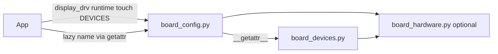

# Board_config end-device contract

Locked plan for a stable `board_config` end-device surface (CircuitPython-like discovery), proven before production retrofit. Implementation may be picked up later (including via cloud agent). Sibling inventory notes live under `~/gh/pydevices/dotgithub/` (`board-inventory.md`, `firmware-fixtures.md`, `pydisplay-display-boards.md`).

## Decisions (from discussion)

- **Specials (unchanged names):** `display_drv`, `runtime` (may be `None`).
- **Optional end devices:** bare names; **omit** if hardware absent.
- **Discovery:** `DEVICES` frozenset listing **all** optional roles on that board (eager + lazy). Apps use `"name" in board_config.DEVICES` before access so probing does not allocate lazy devices. (`hasattr` is unreliable for lazy names because it may construct.)
- **Target module layout (shape A, to prove):** keep **`board_config.py`**; sibling **`board_devices.py`** with lazy constructors; `board_config` re-exports via `__getattr__` / `__dir__`. Optional shared-bus module (**`board_hardware`**) for buses/expanders/power shared by UI and devices — **unproven**; explore only in the proof directory.
- **No temporary aliases:** `touch_drv` → `touch`, `encoder_drv` → `encoder` (breaking; sole-user window).
- **Init (target):** eager for display/runtime/input wired to runtime; lazy for everything else in `board_devices`.
- **Docs:** normative contract in pydisplay; inventory/device matrix in dotgithub.
- **`usb_device`:** optional lazy role for non-tooling native USB via [`machine.USBDevice`](https://docs.micropython.org/en/latest/library/machine.USBDevice.html); tooling USB / UART bridge out of contract.

### Rollout constraint (critical)

Until the multi-file pattern is **proven**:

| Allowed on **existing** `board_configs/` | Not allowed yet on existing configs |
|------------------------------------------|-------------------------------------|
| Consistency renames (`touch_drv`→`touch`, `encoder_drv`→`encoder`, and similar public name cleanups) | Adding `board_devices.py`, `DEVICES`, lazy `__getattr__` |
| Minimal shared-interface prep only if needed for rename consistency (e.g. keep a public `i2c` name stable for a future `board_hardware`) | Splitting buses into `board_hardware`, retrofitting campaign boards |

**All structural / pattern test work** goes in a **new directory** under `board_configs/` (e.g. `board_configs/contract_proof/<board>/` or similar). Retrofit of the ~10 display-campaign boards is **out of scope until proof succeeds**.

## Canonical role names

| Role | Symbol | Notes |
|------|--------|-------|
| Display | `display_drv` | Required special |
| Runtime | `runtime` | Special; may be `None` |
| Touch | `touch` | Eager; wire into `Runtime` when present |
| Keypad | `keypad` | All board buttons (not encoder click) |
| Encoder | `encoder` | Includes click on encoder object / runtime encoder API |
| Joystick | `joystick` | Separate from keypad |
| Addressable LEDs | `pixels` | NeoPixel / DotStar / APA102 |
| Discrete LED | `led` | Primary user LED only |
| Motion | `accelerometer`, `gyroscope`, `magnetometer` | Separate; omit missing axes |
| Environment | `temperature`, `humidity`, `pressure` | Same underlying driver may bind to multiple names |
| Audio | `speaker`, `microphone` | Separate |
| Storage | `sdcard` | Driver object only; no auto-mount |
| Camera | `camera` | |
| Expansion I2C | `i2c` | Only dedicated STEMMA/Qwiic/Grove (not internal-only bus) |
| Power | `battery` | |
| Field / PHY | `can`, `rs485`, `ethernet` | Dedicated board hardware |
| Wi‑Fi co-processor | `radio` | AirLift/C6; **not** SoC WLAN; leave high-level `wifi` free |
| Runtime USB device | `usb_device` | Non-tooling native USB via `machine.USBDevice`; omit tooling bridge / single-port CDC-only unless documented advanced |
| Out of contract | SoC `network.WLAN` / CP `wifi`; tooling USB / UART bridge | Apps use existing stacks / serial host tools |

Contract doc will also define **minimal duck-types** per role (written during doc authoring from existing drivers).

## Architecture (to prove in new directory)

Proof directory layout (illustrative):

- `board_configs/contract_proof/<chosen_board>/board_config.py` — UI + `DEVICES` + lazy re-export
- `board_devices.py` — lazy end-device factories
- `board_hardware.py` — optional; shared buses/expanders/power only (prove or drop)
- `package.json` — all modules in the proof package

Shared boilerplate: tiny helper under `src/lib/` for `install_lazy_devices(...)`. Prefer one real campaign board as the proof target (e.g. T-Embed or RP2040-Touch-LCD-1.28) **copied/adapted into the new directory**, not edited in place.

## Existing-tree changes (lasting, rename-only)

- Replace public `touch_drv` with **`touch`** (private `_touch_read` helpers OK).
- Replace public `encoder_drv` with **`encoder`**.
- Full-repo sweep of examples/docs/tools importing those names; **no shims**.
- Do **not** add `board_devices` / `DEVICES` / `board_hardware` to production config dirs in this phase.

## Planned device matrix (research; not production wiring yet)

Use for docs + proof-directory scope selection. Full table stays in dotgithub after merge.

| Board | Eager (typical) | Lazy candidates |
|-------|-----------------|-----------------|
| Waveshare ESP32-P4-WIFI6-Touch-LCD-4B | `touch` | `speaker`, `microphone`, `sdcard`, `camera`, `ethernet`, `radio`, `usb_device`, … |
| Qualia + TL040HDS20 | `touch`, `keypad` | `i2c` |
| Waveshare S3 Touch LCD 4.3 / 7 | `touch` | `sdcard`, `can`, `rs485`, `usb_device` |
| LILYGO T-RGB | `touch` | `sdcard`, `battery` |
| LILYGO T-Embed | `encoder` | `pixels`, `speaker`, `microphone`, `sdcard`, `battery`, `i2c` |
| LILYGO T-HMI | `touch` | `sdcard`, `i2c` |
| Waveshare RP2040-Touch-LCD-1.28 | `touch` | `accelerometer`, `gyroscope`, `battery` |
| Metro M7 + shield 1947 | `touch` | `pixels`, `led`, `sdcard`, `radio`, `i2c` |
| Nucleo H743ZI2 + shield 1947 | `touch`, `keypad` | `led`, `sdcard`, `ethernet` |

## Documentation deliverables

1. **Normative:** `docs/hardware/board-devices.md` — role table, `DEVICES`, lazy pattern, duck-types, proof-directory pointer. Update `docs/concepts/runtime.md` and `docs/hardware/board-configs.md` for renames; note production configs are rename-only until proof graduates.
2. **Inventory:** in sibling `dotgithub/`, device matrix linking fixture # ↔ product ↔ planned `DEVICES` roles; keep display quirks vs Detect fixtures separated (`board-inventory.md`, `firmware-fixtures.md`, `pydisplay-display-boards.md`).

## Implementation phases

1. **Contract + helper** — docs + lazy-devices helper in `src/lib/`.
2. **Rename sweep only** — `touch` / `encoder` across existing tree.
3. **Proof directory** — new `board_configs/…` package implementing full pattern (+ optional `board_hardware`); smoke `DEVICES` and lazy construct.
4. **Gate** — only after proof is accepted: plan a follow-up to retrofit campaign boards (separate work).

## Out of scope (this phase)

- Retrofitting existing campaign or other production `board_configs` with `board_devices` / `board_hardware`
- All ~146 configs, FunHouse/XIAO/PyGamer full sensor exports, etc.
- Auto-mounting SD, high-level `wifi` as a board_config device, HSTX/DVI as separate roles
