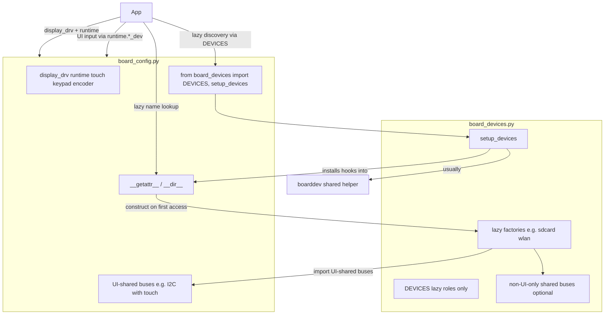

# Board_config end-device contract

Locked plan for a stable `board_config` end-device surface (CircuitPython-like discovery), proven before production retrofit. **Structural plan items are complete** for MicroPython. Sibling inventory notes live under `~/gh/pydevices/micropython-hardware/docs/` (`board-inventory.md`, `firmware-fixtures.md`, `pydisplay-display-boards.md`, `device-matrix.md`).

## Decisions (from discussion)

- **Specials (unchanged names):** `display_drv`, `runtime` (may be `None`).
- **Optional end devices:** bare names; **omit** if hardware absent.
- **Discovery:**
  - **Eager UI roles** (`touch`, `keypad`, `encoder`, `joystick`, …): constructed in `board_config` and wired into `runtime`; **apps discover and use them via `runtime`** (e.g. `runtime.touch_dev is not None`, subscribe/poll on Runtime) — not via `hasattr(board_config, "touch")` or direct driver access. User code should not need to touch these devices on `board_config`.
  - **Lazy roles:** `DEVICES` lists **only** names constructed by `board_devices`. Apps use `"name" in board_config.DEVICES` before access so probing does not allocate. (`hasattr` on lazy names may construct — do not use it for discovery.)
- **Where `DEVICES` is authored:** **`board_devices.DEVICES`** only (next to the factories). `board_config` re-exports that frozenset; no eager UI names in it.
- **Lazy wiring ownership:** `board_devices` owns setup. `board_config` ends with:

  ```python
  from board_devices import DEVICES, setup_devices
  setup_devices(globals())
  ```

  Shared boilerplate lives under `src/lib/` as **`boarddev`** (name signals *devices* side, not `board_config`). Typical `board_devices.setup_devices` is a thin wrapper that calls `boarddev.bind_lazy(...)`. A board may replace `setup_devices` with a custom implementation and skip `boarddev` entirely.
- **Target module layout (shape A, to prove):** keep **`board_config.py`**; sibling **`board_devices.py`** with `DEVICES`, factories, and `setup_devices`; lazy `__getattr__` / `__dir__` installed into `board_config`'s namespace by that call. **No separate `board_hardware` module.**
- **Bus ownership:**
  - Buses shared with **UI devices** (`display_drv`, `touch`, `keypad`, `encoder`, `joystick`, and anything else wired into `runtime`) live in **`board_config`**. Lazy `board_devices` imports those buses from `board_config` when needed (e.g. IMU on the same I2C as touch).
  - Buses shared only among **non-UI** devices may live in **`board_devices`** (e.g. an SPI bus shared by `sdcard` and `radio`, with no display/touch on that bus).
- **No temporary aliases:** `touch_drv` → `touch`, `encoder_drv` → `encoder` (breaking; sole-user window).
- **Init (target):** eager for display/runtime/input wired to runtime; lazy for everything else in `board_devices`.
- **Touch duck-type (depends on LVGL multi-touch design):** `board_config.touch` is the **driver object** used when wiring `Runtime` (may report multiple points); apps interact via `runtime.touch_dev` / LVGL, not the raw driver. Per-board multi→single collapse (`touch_read_func` / `_touch_read` that only returns `points[0]`) is **not** the long-term contract — adapters belong in `eventsys` / LVGL runtime if single-point is still needed. Personal backlog (not blocking this whole plan): facilitate LVGL gestures (`dotgithub/NOTES.md` under LVGL).
- **Docs:** normative contract in micropython-hardware `docs/board-devices.md` (pydisplay concepts remain on RTD); inventory + device matrix in micropython-hardware `docs/` (not dotgithub).
- **`usb_device`:** optional lazy role for non-tooling native USB via [`machine.USBDevice`](https://docs.micropython.org/en/latest/library/machine.USBDevice.html); tooling USB / UART bridge out of contract.
- **Wireless (in contract):** `wlan`, `ble`, `bt` (BT Classic) as optional lazy capability handles — omit when the silicon/board cannot provide that link type. Names chosen to avoid clashing with high-level `wifi` / `bluetooth` modules. Co-processor objects remain **`radio`** (AirLift, C6, …) and may coexist with `wlan`/`ble` when the co-proc is the path that provides them.

### Rollout constraint (critical) — historical

Until the multi-file pattern was **proven**, production campaign dirs stayed rename-only and structural work lived under `contract_proof/`. That gate cleared 2026-07-24; campaign boards graduated into micropython-hardware production paths. Subsequent product boards were retrofitted in place (MP only).

## Canonical role names

| Role | Symbol | Notes |
|------|--------|-------|
| Display | `display_drv` | Required special |
| Runtime | `runtime` | Special; may be `None` |
| Touch | `touch` | Eager in `board_config`; wire into `Runtime`; apps use `runtime.touch_dev` |
| Keypad | `keypad` | All board buttons (not encoder click); apps use `runtime.keypad_dev` |
| Encoder | `encoder` | Includes click; apps use `runtime.encoder_dev` |
| Joystick | `joystick` | Separate from keypad; apps use `runtime.joystick_dev` |
| Addressable LEDs | `pixels` | NeoPixel / DotStar / APA102 |
| Discrete LED | `led` | Primary user LED only |
| Motion | `accelerometer`, `gyroscope`, `magnetometer` | Separate; omit missing axes |
| Environment | `temperature`, `humidity`, `pressure` | Same underlying driver may bind to multiple names |
| Audio | `audio`, `microphone` | `audio` = playback endpoint (speaker, headphones, line-out, …); `microphone` separate |
| Storage | `sdcard` | Driver object only; no auto-mount |
| Camera | `camera` | |
| Expansion I2C | `i2c` | Only dedicated STEMMA/Qwiic/Grove (not internal-only bus) |
| Power | `battery` | |
| Field / PHY | `can`, `rs485`, `ethernet` | Dedicated board hardware |
| Wi‑Fi | `wlan` | Station/AP capability handle; leave high-level `wifi` free for add_ons / CP |
| Bluetooth LE | `ble` | Omit on boards without BLE |
| Bluetooth Classic | `bt` | BR/EDR; omit when absent (many S3 boards are BLE-only) |
| RF co-processor | `radio` | AirLift/C6/etc. for firmware / low-level control; may coexist with `wlan`/`ble` |
| Runtime USB device | `usb_device` | Non-tooling native USB via `machine.USBDevice`; omit tooling bridge / single-port CDC-only unless documented advanced |
| Out of contract | High-level `wifi` / `bluetooth` modules; tooling USB / UART bridge | Apps may still use those stacks; board_config exposes discoverable handles only |

## Architecture


```mermaid
flowchart TB
  app[App]
  subgraph board_config_py [board_config.py]
    ui[display_drv runtime touch keypad encoder]
    uiBuses[UI-shared buses e.g. I2C with touch]
    getattrHook["__getattr__ / __dir__"]
    importSetup["from board_devices import DEVICES, setup_devices"]
  end
  subgraph board_devices_py [board_devices.py]
    lazySet[DEVICES lazy roles only]
    setupFn[setup_devices]
    lazyDevs[lazy factories e.g. sdcard wlan]
    nonUiBuses[non-UI-only shared buses optional]
  end
  boarddev[boarddev shared helper]
  app -->|"display_drv + runtime"| board_config_py
  app -->|"UI input via runtime.*_dev"| board_config_py
  app -->|"lazy discovery via DEVICES"| importSetup
  app -->|"lazy name lookup"| getattrHook
  importSetup --> setupFn
  setupFn -->|"usually"| boarddev
  setupFn -->|"installs hooks into"| getattrHook
  getattrHook -->|"construct on first access"| lazyDevs
  lazyDevs -->|"import UI-shared buses"| uiBuses
  lazyDevs --> nonUiBuses
```

Shared helper: [`src/lib/boarddev.py`](../src/lib/boarddev.py). Production trees live in
[`micropython-hardware/board_configs/`](https://github.com/PyDevices/micropython-hardware/tree/main/board_configs).

## Prerequisite: LVGL touch / gestures

**Done (2026-07-24).** Duck-type locked and proven on Waveshare ESP32-P4-WIFI6-Touch-LCD-4B.

**Locked duck-type:**

1. **`touch.read_points()`** → `()` when up, else a sequence of `(x, y[, id[, …]])`.
2. **Who adapts:** `eventsys.TouchDevice` + `display_driver` for LVGL gestures when APIs exist.
3. **Wrappers:** no per-board multi→single collapse; sequence-preserving maps only.
4. **PGDisplay** stays single-touch (mouse).

## Documentation deliverables

1. **Normative:** `micropython-hardware/docs/board-devices.md` (Pages).
2. **Inventory / matrix:** `micropython-hardware/docs/device-matrix.md` (campaign + product retrofit tables).

## Implementation phases

1. **LVGL touch design (gate)** — **done.**
2. **Contract + helper** — **done.**
3. **Mechanical rename sweep** — **done.**
4. **Campaign boards in `contract_proof/`** — **done** (graduated to micropython-hardware).
5. **Gate** — **done (2026-07-24).**
6. **Graduate + repo split** — **done.**
7. **Device matrix (research)** — **done.**
8. **MP product retrofit** — **done.** All device-matrix product rows that have an MP
   `board_config` now use the split layout. Feather RP2040 DVI remains CP-only POC
   (no MP config). CircuitPython `cp/` twins deferred. Some lazy factories still
   raise until chip drivers are filled — that is factory work, not contract work.

## CircuitPython policy (locked)

- **No** `board_devices.py` / `DEVICES` / `setup_devices` under `board_configs/cp/`.
- **No** `from board_config import …` inside CP configs.
- CP `board_config.py` implements eager UI only: `display_drv`, `runtime`, and
  inputs that wire into `runtime` (`touch`, `keypad`, `encoder`, `joystick`)
  with the same contract names as MicroPython.
- Non-UI peripherals (sensors, SD, WLAN, …) use CircuitPython’s native `board`
  + libraries — not a pydisplay lazy layer.

## Follow-ups (out of this plan)

- Fill remaining MicroPython `NotImplementedError` factories (camera on P4/CoreS3/Tab5, …).
- Optional real MP Feather RP2040 DVI implementation if a low-RAM path becomes viable (stub at `fbdisplay/adafruit_feather_rp2040_dvi_320x240` raises today).
- Personal backlog: LVGL gesture UX polish (`dotgithub/NOTES.md`).

## Out of scope (completed-plan boundaries)

- A third `board_hardware` module
- Auto-mounting SD; using `wifi`/`bluetooth` as board_config symbols
- HSTX/DVI as separate contract roles (they remain `display_drv` backends)
- Retrofitting every generic epaper/OLED breakout that has no meaningful lazy extras
