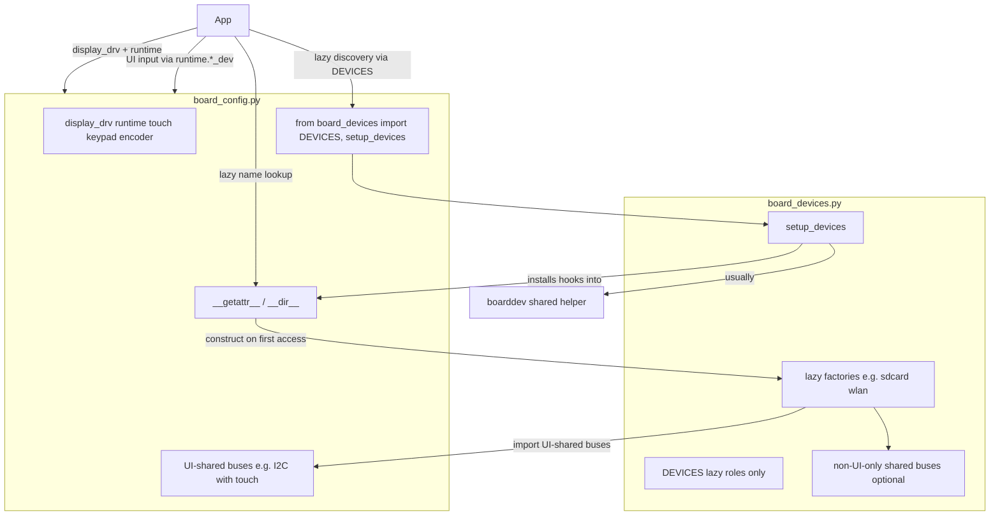

# Board_config end-device contract

Locked plan for a stable `board_config` end-device surface (CircuitPython-like discovery), proven before production retrofit. Implementation may be picked up later (including via cloud agent). Sibling inventory notes live under `~/gh/pydevices/dotgithub/` (`board-inventory.md`, `firmware-fixtures.md`, `pydisplay-display-boards.md`).

## Decisions (from discussion)

- **Specials (unchanged names):** `display_drv`, `runtime` (may be `None`).
- **Optional end devices:** bare names; **omit** if hardware absent.
- **Discovery:**
  - **Eager UI roles** (`touch`, `keypad`, `encoder`, `joystick`, …): constructed in `board_config` and wired into `runtime`; **apps discover and use them via `runtime`** (e.g. `runtime.touch_dev is not None`, subscribe/poll on Runtime) — not via `hasattr(board_config, "touch")` or direct driver access. User code should not need to touch these devices on `board_config`.
  - **Lazy roles:** `DEVICES` lists **only** names constructed by `board_devices`. Apps use `"name" in board_config.DEVICES` before access so probing does not allocate. (`hasattr` on lazy names may construct — do not use it for discovery.)
- **Where `DEVICES` is authored:** **`board_devices.DEVICES`** only (next to the factories). `board_config` re-exports that frozenset; no eager UI names in it.
- **Lazy wiring ownership:** `board_devices` owns setup. `board_config` ends with:

  ```python
  from board_devices import DEVICES, setup_devices
  setup_devices(globals())
  ```

  Shared boilerplate lives under `src/lib/` as **`boarddev`** (name signals *devices* side, not `board_config`). Typical `board_devices.setup_devices` is a thin wrapper that calls `boarddev.bind_lazy(...)`. A board may replace `setup_devices` with a custom implementation and skip `boarddev` entirely.
- **Target module layout (shape A, to prove):** keep **`board_config.py`**; sibling **`board_devices.py`** with `DEVICES`, factories, and `setup_devices`; lazy `__getattr__` / `__dir__` installed into `board_config`'s namespace by that call. **No separate `board_hardware` module.**
- **Bus ownership:**
  - Buses shared with **UI devices** (`display_drv`, `touch`, `keypad`, `encoder`, `joystick`, and anything else wired into `runtime`) live in **`board_config`**. Lazy `board_devices` imports those buses from `board_config` when needed (e.g. IMU on the same I2C as touch).
  - Buses shared only among **non-UI** devices may live in **`board_devices`** (e.g. an SPI bus shared by `sdcard` and `radio`, with no display/touch on that bus).
- **No temporary aliases:** `touch_drv` → `touch`, `encoder_drv` → `encoder` (breaking; sole-user window).
- **Init (target):** eager for display/runtime/input wired to runtime; lazy for everything else in `board_devices`.
- **Touch duck-type (depends on LVGL multi-touch design):** `board_config.touch` is the **driver object** used when wiring `Runtime` (may report multiple points); apps interact via `runtime.touch_dev` / LVGL, not the raw driver. Per-board multi→single collapse (`touch_read_func` / `_touch_read` that only returns `points[0]`) is **not** the long-term contract — adapters belong in `eventsys` / LVGL runtime if single-point is still needed. Personal backlog (not blocking this whole plan): facilitate LVGL gestures (`dotgithub/NOTES.md` under LVGL).
- **Docs:** normative contract in pydisplay; inventory/device matrix in dotgithub.
- **`usb_device`:** optional lazy role for non-tooling native USB via [`machine.USBDevice`](https://docs.micropython.org/en/latest/library/machine.USBDevice.html); tooling USB / UART bridge out of contract.
- **Wireless (in contract):** `wlan`, `ble`, `bt` (BT Classic) as optional lazy capability handles — omit when the silicon/board cannot provide that link type. Names chosen to avoid clashing with high-level `wifi` / `bluetooth` modules. Co-processor objects remain **`radio`** (AirLift, C6, …) and may coexist with `wlan`/`ble` when the co-proc is the path that provides them.

### Rollout constraint (critical)

Until the multi-file pattern is **proven**:

| Allowed on **existing** `board_configs/` | Not allowed yet on existing configs |
|------------------------------------------|-------------------------------------|
| Consistency renames: end devices (`touch_drv`→`touch`, `encoder_drv`→`encoder`) **and** infrastructure buses/expanders (see Existing-tree) so names are stable for later `board_devices` imports | Adding `board_devices.py`, `DEVICES`, lazy `__getattr__` to production paths |
| Apply the same bus naming even on boards that do not yet share those buses with lazy devices | Overwriting / replacing production campaign dirs with the new split |

**Structural / pattern work is in scope for the ~10 display-campaign boards**, but only under **`board_configs/contract_proof/<board>/`** (copy/adapt from the production `board_configs/…` path — do not edit those production dirs for the split). Graduating a proven proof tree back into the production path is a later step.

## Canonical role names

| Role | Symbol | Notes |
|------|--------|-------|
| Display | `display_drv` | Required special |
| Runtime | `runtime` | Special; may be `None` |
| Touch | `touch` | Eager in `board_config`; wire into `Runtime`; apps use `runtime.touch_dev` |
| Keypad | `keypad` | All board buttons (not encoder click); apps use `runtime.keypad_dev` |
| Encoder | `encoder` | Includes click; apps use `runtime.encoder_dev` |
| Joystick | `joystick` | Separate from keypad; apps use `runtime.joystick_dev` |
| Addressable LEDs | `pixels` | NeoPixel / DotStar / APA102 |
| Discrete LED | `led` | Primary user LED only |
| Motion | `accelerometer`, `gyroscope`, `magnetometer` | Separate; omit missing axes |
| Environment | `temperature`, `humidity`, `pressure` | Same underlying driver may bind to multiple names |
| Audio | `audio`, `microphone` | `audio` = playback endpoint (speaker, headphones, line-out, …); `microphone` separate |
| Storage | `sdcard` | Driver object only; no auto-mount |
| Camera | `camera` | |
| Expansion I2C | `i2c` | Only dedicated STEMMA/Qwiic/Grove (not internal-only bus) |
| Power | `battery` | |
| Field / PHY | `can`, `rs485`, `ethernet` | Dedicated board hardware |
| Wi‑Fi | `wlan` | Station/AP capability handle; leave high-level `wifi` free for add_ons / CP |
| Bluetooth LE | `ble` | Omit on boards without BLE |
| Bluetooth Classic | `bt` | BR/EDR; omit when absent (many S3 boards are BLE-only) |
| RF co-processor | `radio` | AirLift/C6/etc. for firmware / low-level control; may coexist with `wlan`/`ble` |
| Runtime USB device | `usb_device` | Non-tooling native USB via `machine.USBDevice`; omit tooling bridge / single-port CDC-only unless documented advanced |
| Out of contract | High-level `wifi` / `bluetooth` modules; tooling USB / UART bridge | Apps may still use those stacks; board_config exposes discoverable handles only |

Contract doc will also define **minimal duck-types** per role (written during doc authoring from existing drivers).

## Architecture (to prove in new directory)


```mermaid
flowchart TB
  app[App]
  subgraph board_config_py [board_config.py]
    ui[display_drv runtime touch keypad encoder]
    uiBuses[UI-shared buses e.g. I2C with touch]
    getattrHook["__getattr__ / __dir__"]
    importSetup["from board_devices import DEVICES, setup_devices"]
  end
  subgraph board_devices_py [board_devices.py]
    lazySet[DEVICES lazy roles only]
    setupFn[setup_devices]
    lazyDevs[lazy factories e.g. sdcard wlan]
    nonUiBuses[non-UI-only shared buses optional]
  end
  boarddev[boarddev shared helper]
  app -->|"display_drv + runtime"| board_config_py
  app -->|"UI input via runtime.*_dev"| board_config_py
  app -->|"lazy discovery via DEVICES"| importSetup
  app -->|"lazy name lookup"| getattrHook
  importSetup --> setupFn
  setupFn -->|"usually"| boarddev
  setupFn -->|"installs hooks into"| getattrHook
  getattrHook -->|"construct on first access"| lazyDevs
  lazyDevs -->|"import UI-shared buses"| uiBuses
  lazyDevs --> nonUiBuses
```

Proof directory layout (one subdirectory per display-campaign board):

- `board_configs/contract_proof/<board>/board_config.py` — UI devices, UI-shared buses; `from board_devices import DEVICES, setup_devices` + `setup_devices(globals())`
- `board_configs/contract_proof/<board>/board_devices.py` — `DEVICES`, factories, `setup_devices` (wraps `boarddev` or custom)
- `board_configs/contract_proof/<board>/package.json` — both modules in the proof package

Shared helper: single-file [`src/lib/boarddev.py`](../src/lib/boarddev.py) (preferred over a package unless it grows). Illustrative target:

```python
"""Lazy end-device binding for board_devices → board_config.

board_devices.setup_devices(globals()) typically calls bind_lazy(ns, this_module).
Apps never import boarddev; they use board_config.DEVICES and attribute access.
"""

def bind_lazy(ns, devices_mod):
    """Install module __getattr__/__dir__ on ns for names in devices_mod.DEVICES.

    Each name maps to a zero-arg factory devices_mod.<name>(). First access
    constructs, caches into ns[name], and returns the object. Further access
    hits the module dict (no __getattr__).
    """
    roles = devices_mod.DEVICES

    def __getattr__(name):
        if name not in roles:
            raise AttributeError("module has no attribute {!r}".format(name))
        factory = getattr(devices_mod, name)
        obj = factory()
        ns[name] = obj  # cache; skips __getattr__ next time
        return obj

    def __dir__():
        # MP/CPython: show real attrs plus lazy roles not yet constructed
        names = list(ns.keys())
        for role in roles:
            if role not in ns:
                names.append(role)
        return sorted(names)

    ns["__getattr__"] = __getattr__
    ns["__dir__"] = __dir__
```

Notes for implementers: keep it stdlib-free and MicroPython-safe; no typing; factories must be zero-arg callables named exactly like the role; missing factory is a hard error at first access (do not silently omit). Start from copies of the production campaign configs (see matrix below). Production paths stay rename-only until a proof board graduates.

### Example: LILYGO T-HMI (`board_configs/contract_proof/t-hmi/`)

Illustrative shape only — pin/init details copy from production [`board_configs/busdisplay/i80/t-hmi/board_config.py`](../board_configs/busdisplay/i80/t-hmi/board_config.py). Touch SPI stays in `board_config` (UI-shared). Grove `i2c`, `sdcard`, `wlan`, `ble` are lazy.

**`board_config.py`**

```python
"""contract_proof: LILYGO T-HMI — UI eager; extras via board_devices."""
from i80bus import I80Bus
from machine import SPI, Pin
from st7789 import ST7789
from xpt2046 import Touch
import eventsys

Pin(14, Pin.OUT, value=1)  # PWR_ON
Pin(10, Pin.OUT, value=1)  # PWR_EN

display_bus = I80Bus(dc=7, cs=6, wr=8, data=[48, 47, 39, 40, 41, 42, 45, 46])
display_drv = ST7789(display_bus, width=240, height=320, ...)  # as today

# Touch owns this SPI — UI bus lives here (not in board_devices).
touch_spi = SPI(1, baudrate=2_000_000, polarity=0, phase=0, sck=Pin(1), mosi=Pin(3), miso=Pin(4))
touch = Touch(spi=touch_spi, cs=Pin(2), int_pin=Pin(9))
touch.calibrate(...)  # same as production

def _touch_read():
    ...  # holdoff helper; return () or sequence of points

runtime = eventsys.Runtime(
    display=display_drv,
    touch_read=_touch_read,
    touch_rotation_table=(0b100, 0b100, 0b100, 0b100),
)

from board_devices import DEVICES, setup_devices
setup_devices(globals())
```

**`board_devices.py`**

```python
"""Lazy constructors for T-HMI non-UI devices. DEVICES = lazy roles only."""
import boarddev
import sys

DEVICES = frozenset({"sdcard", "i2c", "wlan", "ble"})

def setup_devices(ns):
    boarddev.bind_lazy(ns, sys.modules[__name__])

def sdcard():
    # SD_MMC / SPI SD — pins from LilyGO; no UI bus shared with display/touch.
    from machine import SDCard  # or board-specific driver
    return SDCard(...)

def i2c():
    # Primary Grove connector (expansion); not the touch SPI.
    from machine import I2C, Pin
    return I2C(0, sda=Pin(4), scl=Pin(5), freq=400_000)  # pins illustrative

def wlan():
    import network
    return network.WLAN(network.STA_IF)

def ble():
    import bluetooth
    return bluetooth.BLE()
```

**App usage**

```python
import board_config as board
from board_config import display_drv, runtime

display_drv.fill(0)

# Eager UI — discover/use through runtime (not board.touch)
if runtime.touch_dev is not None:
    runtime.touch_dev.subscribe(...)  # or eventsys filters / LVGL path

# Lazy extras — DEVICES only (do not hasattr these)
if "sdcard" in board.DEVICES:
    card = board.sdcard  # constructs now
if "wlan" in board.DEVICES:
    wlan = board.wlan
    wlan.active(True)
```

## Existing-tree changes (lasting, rename-only)

End-device and infrastructure names only — still no `board_devices` / `DEVICES` on production paths. Full-repo sweep of examples/docs/tools; **no shims**.

### End devices (names only in this sweep)

- Replace public `touch_drv` with **`touch`**. **Done.**
- Replace public `encoder_drv` with **`encoder`**. **Done.**
- Drop multi→single `touch_read_func` collapses; keep only sequence-preserving maps / holdoff. **Done.**

### Infrastructure (buses, expanders) — name now for later sharing

These live in `board_config` when UI-owned (see Bus ownership). Rename for consistency **even when nothing else shares the bus yet**, so `board_devices` can later `from board_config import i2c` (etc.) without a second rename pass.

| Kind | Canonical name | Notes |
|------|----------------|-------|
| Primary shared I2C | `i2c` | Already common; prefer over `_i2c` / `touch_i2c` when it is the board's main bus |
| Primary shared SPI | `spi` | Prefer over anonymous/local-only SPI when the bus object is module-level |
| Additional SPI buses | role-qualified: `touch_spi`, `sd_spi`, … | Use when more than one SPI exists; do not leave a second bus as bare `spi2` unless there is no clearer role |
| Display protocol bus | `display_bus` | SPIBus / I80Bus / FourWire / **MIPI `Bus`** / … — one name for whatever feeds `display_drv`. Rename bare MIPI `bus` → `display_bus`; not the same as raw `spi` |
| Primary IO expander | `io_expander` | e.g. Qualia `iox` → `io_expander`; chip type stays in the constructor |
| Extra expanders | role- or chip-qualified | e.g. `touch_io_expander` only when a second expander is required |

Do **not** invent module-level bus aliases that are unused; do **bind a stable name** whenever a bus/expander object is already assigned at module scope (or should be, so touch/display init and a future lazy device can share it).

Do **not** add `board_devices` / `DEVICES` to production config dirs in this phase.

## Prerequisite: LVGL touch / gestures (design before structural touch edits)

**Done (2026-07-24).** Duck-type locked and proven on Waveshare ESP32-P4-WIFI6-Touch-LCD-4B: `lv_gestures` pinch works with GT911 multipoint → `TouchDevice.points` → `display_driver` gesture feed. On-device fix was syncing `gt911.read_points()` to the sequence contract and removing the board’s `touch_read_func` multi→single collapse.

**Locked duck-type** (implemented in drivers / eventsys / `display_driver`):

1. **`touch.read_points()`** → `()` when up, else a sequence of `(x, y[, id[, …]])`. Never a bare `(x, y)` from this method (ambiguity with a 2-tuple point). Single-touch chips return `()` or one-element sequence.
2. **Who adapts:** `eventsys.TouchDevice` rotates all points, emits primary-finger MOUSE*, exposes `touch_dev.points`. `display_driver` feeds LVGL `indev_gesture_recognizers_update` / `set_data` when those APIs exist (`hasattr` gate for float/gesture-off builds). Non-LVGL apps keep using primary MOUSE* — no per-board collapse.
3. **Wrappers:** delete `n, points = …; return points[0]` board helpers. Keep only thin board-specific maps (e.g. non-square diagonal rescale on S3 4.3″) that transform the **whole sequence**.
4. **PGDisplay** stays single-touch (mouse). Real SDL multitouch uses `SDL_FINGER*` via usdl2 → `sdldisplay` → `VirtualDevices.points`.

Mechanical renames (`touch_drv`→`touch`, buses) and dropping remaining collapse wrappers may proceed; production configs should pass `touch_read=touch.read_points` (or a sequence-preserving map).

## Campaign boards in `contract_proof/` (in scope)

These are the first-wave targets — implement under `board_configs/contract_proof/…`, not by editing production dirs. Full table also lives in dotgithub after merge.

| Board | Eager (typical) | Lazy candidates |
|-------|-----------------|-----------------|
| Waveshare ESP32-P4-WIFI6-Touch-LCD-4B | `touch` | `audio`, `microphone`, `sdcard`, `camera`, `ethernet`, `radio`, `wlan`, `ble`, `usb_device`, … |
| Qualia + TL040HDS20 | `touch`, `keypad` | `i2c`, `wlan`, `ble` |
| Waveshare S3 Touch LCD 4.3 / 7 | `touch` | `sdcard`, `can`, `rs485`, `usb_device`, `wlan`, `ble` |
| LILYGO T-RGB | `touch` | `sdcard`, `battery`, `wlan`, `ble` |
| LILYGO T-Embed | `encoder` | `pixels`, `audio`, `microphone`, `sdcard`, `battery`, `i2c`, `wlan`, `ble` |
| LILYGO T-HMI | `touch` | `sdcard`, `i2c`, `wlan`, `ble` |
| Waveshare RP2040-Touch-LCD-1.28 | `touch` | `accelerometer`, `gyroscope`, `battery` (no onboard `wlan`/`ble`/`bt`) |
| Metro M7 + shield 1947 | `touch` | `pixels`, `led`, `sdcard`, `radio`, `wlan`, `i2c` |
| Nucleo H743ZI2 + shield 1947 | `touch`, `keypad` | `led`, `sdcard`, `ethernet` |

(`bt` Classic: none of these campaign boards are expected to expose it; omit. Role remains in the contract for boards that do.)

## Documentation deliverables

1. **Normative:** `docs/hardware/board-devices.md` — role table, `DEVICES`, lazy pattern, bus ownership, duck-types, proof-directory pointer. Update `docs/concepts/runtime.md` and `docs/hardware/board-configs.md` for renames; note production configs are rename-only until proof graduates.
2. **Inventory:** in sibling `dotgithub/`, device matrix linking fixture # ↔ product ↔ planned `DEVICES` roles; keep display quirks vs Detect fixtures separated (`board-inventory.md`, `firmware-fixtures.md`, `pydisplay-display-boards.md`).

## Implementation phases

1. **LVGL touch design (gate)** — **done.** Duck-type + adapter ownership proven (`lv_gestures` pinch on P4 campaign board).
2. **Contract + helper** — **done.** Normative [`docs/hardware/board-devices.md`](../docs/hardware/board-devices.md); `src/lib/boarddev.py` + unit test.
3. **Mechanical rename sweep** — **done.** `touch` / `encoder` / `display_bus` / `io_expander`; collapses → `_touch_points` / `_map_touch_points` / direct `read_points`.
4. **Campaign boards in `contract_proof/`** — **done.** Ten boards graduated into
   [`micropython-hardware` board_configs](https://github.com/PyDevices/micropython-hardware/tree/main/board_configs)
   (split `board_config` + `board_devices`); `tests/test_contract_proof.py`
   resolves the sibling checkout for structural + `boarddev` smoke.
5. **Gate** — **done (2026-07-24).** On-device smoke confirmed; proof accepted.
6. **Graduate + repo split** — **done.** Trees live in
   [`PyDevices/micropython-hardware`](https://github.com/PyDevices/micropython-hardware);
   ten campaign boards graduated to split layout there. pydisplay no longer
   ships `board_configs/` or `drivers/`. ← **next:** retrofit remaining
   boards + optional dotgithub matrix.

## Repo split (later — locked sequencing)

| Timing | Verdict |
|--------|---------|
| Before this plan | No — unstable touch API + double migration of MIP/`package.json`/docs/matrix |
| During proof / renames | No — same files and paths thrash |
| After `contract_proof/` is green, before full-tree `board_devices` retrofit | Yes |

- **Moves:** `board_configs/`, `drivers/` (configs import drivers — one product).
- **Stays in pydisplay:** `src/lib/` (`boarddev`, `eventsys`, …), normative contract docs, examples/tooling that *consume* boards.
- **Graduation:** prefer landing proven trees in the new repo (or move then graduate) rather than fully retrofitting production paths inside pydisplay and extracting afterward.

## Out of scope (this phase)

- Editing production campaign dirs to add `board_devices` / `DEVICES` (use `contract_proof/` instead)
- A third `board_hardware` module
- Non-campaign / remaining ~146 configs, FunHouse/XIAO/PyGamer full sensor exports, etc.
- Auto-mounting SD; using `wifi`/`bluetooth` as board_config symbols (use `wlan`/`ble`/`bt`); HSTX/DVI as separate roles
- Shipping complete LVGL gesture UX (personal NOTES item; only the touch duck-type is in-scope here)
- Executing the `board_configs`/`drivers` repo extract (phase 6 — separate effort after proof)
