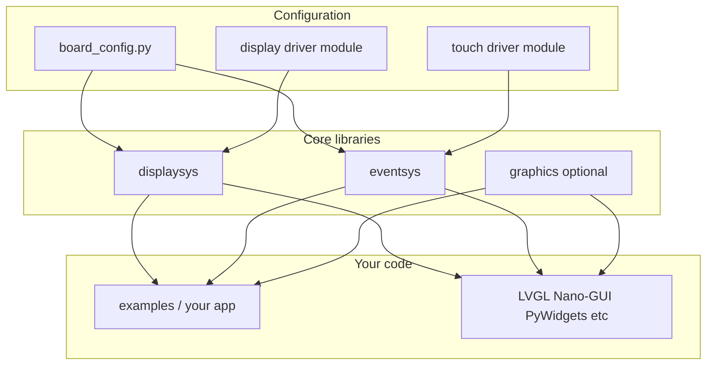

# Architecture

pydisplay is a **foundation layer** — display drivers, input events, drawing primitives, and board wiring. It is not a GUI toolkit. Your app (or a third-party GUI library) sits on top.

## Component diagram



## What each piece does

| Piece | Role |
|-------|------|
| **`board_config.py`** | Selects display class, wires pins, creates touch/keypad/encoder brokers. One file per hardware target. |
| **`displaysys`** | Display backends (`BusDisplay`, `SDL2Display`, `PSDisplay`, …) with a unified drawing API. |
| **`eventsys`** | Brokers poll hardware and enqueue PyGame/SDL2-style events; your loop calls `Broker.poll()`. |
| **`graphics`** | Optional helpers on top of `framebuf` (rounded rects, gradients, `Area` bounding boxes). |
| **`add_ons`** | Optional shims and integrations (`framebuf` on CPython, `displaybuf`, `pdwidgets`, config templates). |

## Typical boot sequence

1. Install packages (MIP, clone, or Wokwi `mip.install`).
2. Import or install `board_config.py` for your hardware.
3. `board_config` constructs `display` and brokers.
4. Your main loop: draw on `display`, call `broker.poll()`, handle events.

```python
import board_config
from board_config import display, broker

while True:
    for event in broker.poll():
        ...  # handle touch, keys, etc.
    display.fill_rect(0, 0, 10, 10, 0xF800)
    display.show()
```

On desktop, `board_config` usually selects `SDL2Display` or `PGDisplay`. On ESP32, `BusDisplay` talks to the panel over SPI or I80.

## Where to go next

- [Displays](displays.md) — pick a display driver class
- [Events](events.md) — brokers, subscribe, poll loop
- [Board configs](../hardware/board-configs.md) — find or add hardware wiring
- [API reference (core)](../reference/) — method signatures
