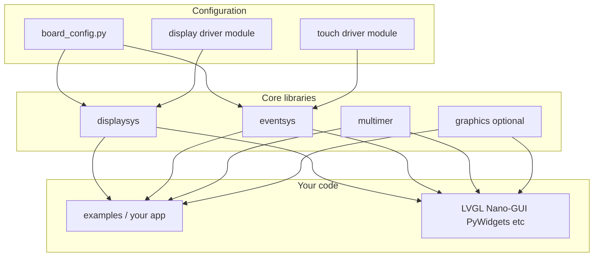

# Architecture

pydisplay is a **foundation layer** — display drivers, input events, drawing primitives, and board wiring. It is not a GUI toolkit. Your app (or a third-party GUI library) sits on top.

## Component diagram



## What each piece does

| Piece | Role |
|-------|------|
| **`board_config.py`** | Selects display class, wires pins, creates `display_drv` and optional `runtime`. One file per hardware target. |
| **`displaysys`** | Display backends (`BusDisplay`, `SDLDisplay`, `PGDisplay`, `PSDisplay`, `JNDisplay`, `FBDisplay`) with a unified drawing API. |
| **`eventsys`** | `Runtime` pumps input and dispatches PyGame/SDL2-style events to callbacks; prefer `runtime.on(...)` + `runtime.run_forever()`. |
| **`graphics`** | Optional helpers on top of `framebuf` (rounded rects, gradients, `Area` bounding boxes). |
| **`multimer`** | Cross-platform `Timer` / `AsyncTimer`, ticks/sleep, and `asyncio` exposure. |
| **`add_ons`** | Optional shims and integrations (`framebuf` on CPython, `displaybuf`, `pdwidgets`, config templates). |

## Typical boot sequence

1. Install packages (MIP, clone, or Wokwi `mip.install`).
2. Import or install `board_config.py` for your hardware.
3. `board_config` constructs `display_drv` and `runtime` (or `runtime = None` on display-only MCU boards).
4. Build the UI, subscribe callbacks, then `runtime.run_forever()` (hosted backends refresh via `Runtime` when `needs_refresh` is true).

```python
from board_config import display_drv, runtime

display_drv.fill_rect(0, 0, 10, 10, 0xF800)
display_drv.show()

def on_click(event):
    ...  # handle touch, keys, etc.

runtime.on(runtime.events.MOUSEBUTTONDOWN, on_click)
runtime.run_forever()
```

See [Runtime](runtime.md), [multimer](multimer.md), and [Events](events.md).

On desktop, `board_config` selects `PGDisplay` (CPython, PyGame) or `SDLDisplay` (SDL2). On ESP32, `BusDisplay` talks to the panel over SPI or I80. See [Portability & platforms](../platforms/index.md) for the full backend matrix.

For a complete minimal app using this pattern (plus scrolling and timers), see [**pydisplay_demo**](../examples/pydisplay_demo.md).

## Where to go next

- [Displays](displays.md) — pick a display driver class
- [Runtime](runtime.md) — board_config contract, auto-refresh, quit lifecycle
- [Events](events.md) — devices, subscribe, `run_forever`
- [Board configs](../hardware/board-configs.md) — find or add hardware wiring
- [API reference (core)](../reference/) — method signatures
