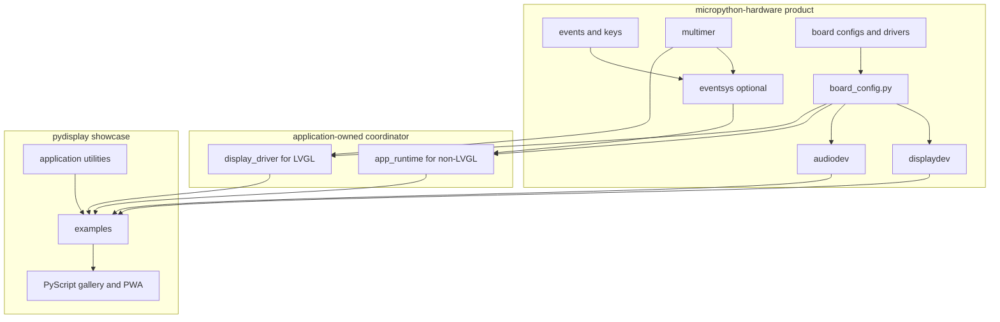

# Architecture

PyDevices separates reusable product code from application examples:

- [`micropython-hardware`](https://github.com/PyDevices/micropython-hardware)
  owns portable interfaces, hardware drivers, board wiring, and releases.
- `pydisplay` owns examples, application helpers, integration docs, and the
  PyScript/PWA gallery.

## Component diagram


```mermaid
flowchart TB
  subgraph product [micropython-hardware product]
    BC[board_config.py]
    DD[displaydev]
    AD[audiodev]
    EV[events and keys]
    MT[multimer]
    ES[eventsys optional]
    DR[board configs and drivers]
  end
  subgraph coordinator [application-owned coordinator]
    AR[app_runtime for non-LVGL]
    LR[display_driver for LVGL]
  end
  subgraph showcase [pydisplay showcase]
    EX[examples]
    UT[application utilities]
    PW[PyScript gallery and PWA]
  end

  DR --> BC
  BC --> DD
  BC --> AD
  EV --> ES
  MT --> ES
  BC --> AR
  ES --> AR
  BC --> LR
  MT --> LR
  AR --> EX
  LR --> EX
  DD --> EX
  AD --> EX
  EX --> PW
  UT --> EX
```

## Responsibilities

| Piece | Role |
|---|---|
| `board_config.py` | Creates hardware interfaces such as `display_drv` and exports neutral input/timing capabilities. It does not create an application runtime. |
| `displaydev` | Cross-platform display interfaces and desktop/browser backends. |
| `audiodev` | Cross-platform audio output/input interfaces and host backends. |
| `events` / `keys` | Shared event types, key codes, modifiers, and matching helpers. |
| `multimer` | Cross-platform `Timer`, `AsyncTimer`, ticks, sleep, and asyncio exposure. |
| `eventsys` | Optional event traffic controller for applications that want the supplied dispatcher and input adapters. |
| `app_runtime` | pydisplay's non-LVGL opt-in: creates an `eventsys.Runtime` from the selected board config and adds gallery test behavior. |
| `display_driver` | LVGL-specific coordinator shared by the binding repos; bridges LVGL to `displaydev` and `multimer` without importing `eventsys`. |
| `utils` | Example helpers and third-party GUI integration adapters. |

## Non-LVGL boot sequence

1. Install the product packages and a board config.
2. Import `display_drv` from `board_config`.
3. Import `runtime` from pydisplay's `app_runtime`, or create your own
   `eventsys.Runtime.from_board_config(board_config)`.
4. Build the UI, register callbacks, and run the coordinator.

```python
from board_config import display_drv
from app_runtime import runtime

display_drv.fill_rect(0, 0, 10, 10, 0xF800)
display_drv.show()


def on_click(event):
    ...


runtime.on(runtime.events.MOUSEBUTTONDOWN, on_click)
runtime.run_forever()
```

`eventsys` is optional product functionality: applications may supply a
different dispatcher or event loop instead.

## LVGL boot sequence

LVGL applications import the coordinator supplied with the binding:

```python
from board_config import display_drv
from display_driver import runtime

runtime.run_forever()
```

The LVGL coordinator owns tick/task handling, display presentation, input-device
adapters, and quit lifecycle. It consumes neutral board-config exports and
`multimer`; it does not depend on `eventsys`.

## Where to go next

- [Runtime](runtime.md) — optional eventsys application coordination
- [Events](events.md) — event model and devices
- [Displays](displays.md) — display interfaces
- [multimer](multimer.md) — portable timers
- [Board configs](https://pydevices.github.io/micropython-hardware/board-configs.html) — hardware wiring
- [Examples](../examples/index.md) — complete applications
