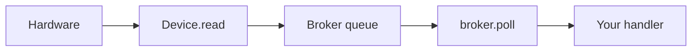

# Events

Input is unified through [`eventsys`](https://github.com/PyDevices/pydisplay/tree/main/src/lib/eventsys) — event names and device types follow PyGame/SDL2 where possible.

See [Architecture](architecture.md) for how brokers connect to `board_config.py`.

## Poll loop



Typical main loop:

```python
import board_config
from board_config import broker, display

while True:
    for event in broker.poll():
        if event.type == events.MOUSEBUTTONDOWN:
            ...  # handle touch / click
    display.show()
```

Run [`eventsys_simpletest.py`](https://github.com/PyDevices/pydisplay/blob/main/src/examples/eventsys_simpletest.py) after [first run](../guides/desktop-cpython.md). For a copy-paste app template with clicks, see [**App starter**](../examples/app-starter.md). For rotation and scrolling together, see [**pydisplay_demo**](../examples/pydisplay_demo.md).

## Subscribe vs poll

**Poll** — drain all queued events each frame (most examples).

**Subscribe** — register a callback for specific event types:

```python
def on_touch(event):
    print(event)

broker.subscribe(on_touch, event_types=[events.MOUSEBUTTONDOWN, events.MOUSEBUTTONUP])
```

See [API reference → eventsys.devices.Broker](../reference/eventsys/devices.md).

## Device types

| Device | Source examples |
|--------|-----------------|
| Touch | Touchscreen, mouse |
| Key / Keypad | Keyboard, matrix keypad |
| Encoder | Rotary encoder, mouse scroll wheel |
| Joystick | Game controller |

The same event types fire regardless of physical hardware — develop on desktop with a mouse, deploy with a touchscreen.

## Brokers

`board_config.py` typically sets up brokers that poll hardware and enqueue events:

- Touch brokers read `touch_read_func`
- Keypad brokers scan GPIO
- Encoder brokers count steps

Use polling in your main loop or integrate with a GUI library's event loop.

## Custom device types

`eventsys.custom_type()` registers application-specific event classes. See [API reference → eventsys.custom_type](../reference/eventsys/index.md).

## Next

- [App starter](../examples/app-starter.md) — copy-paste app boilerplate
- [Displays](displays.md)
- [ESP32 quick start](../guides/esp32-board.md)
- [PyScript asyncio](../guides/pyscript-asyncio.md) — async poll loops

## API reference

[API reference (core)](../reference/) → `eventsys`.
