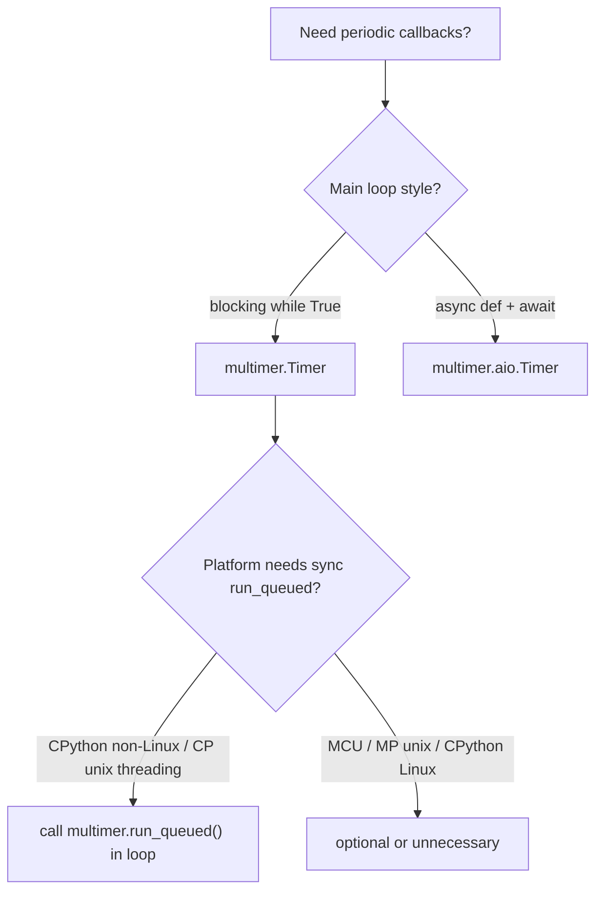

# multimer

Cross-platform periodic timers with a `machine.Timer`-compatible API. pydisplay uses multimer for `auto_refresh`, frame pacing, and other timed callbacks.

## Two entry points

| Import | When to use |
|--------|-------------|
| `from multimer import Timer, run_queued, …` | Default — blocking or threaded main loops (MCU, desktop SDL, CircuitPython unix) |
| `from multimer.aio import Timer, run_queued, run` | Opt-in — apps that already run under **asyncio** / **uasyncio** (PyScript, async ports) |

`multimer.aio` is **not** wired into `multimer.Timer`. The package picks a platform backend automatically (`machine.Timer`, POSIX timers, SDL, threads, …). Choose `multimer.aio` explicitly when your app is asyncio-native.

## Default `multimer.Timer`

```python
from multimer import Timer, run_queued

def callback(timer):
    print("tick")

tim = Timer(-1)
tim.init(mode=Timer.PERIODIC, period=500, callback=callback)

while True:
    run_queued()   # required on some backends — see below
    do_other_work()
```

On **CPython (non-Linux)** and **CircuitPython unix**, timer callbacks from the threading backend are delivered via a schedule queue. Call the sync **`multimer.run_queued()`** from your main loop to drain it.

On **MicroPython unix** (POSIX backend) and **CPython Linux** (`_ctypes`), timer callbacks run on the main thread automatically — sync **`multimer.run_queued()`** is harmless but not required for the timer itself.

On **MicroPython Windows** and other ports without `machine.Timer` or threads, multimer uses **`_polling.Timer`**: `Timer.REQUIRES_RUN_QUEUED` is **true** while **`multimer.REQUIRES_RUN_QUEUED`** (module flag) is **false**. Hand-rolled example loops must check **`getattr(Timer, "REQUIRES_RUN_QUEUED", False)`** and call **`broker.poll()`** on Windows SDL — see [`tiny_toasters.py`](https://github.com/PyDevices/pydisplay/blob/main/src/examples/tiny_toasters/tiny_toasters.py). LVGL apps call **`display_driver.run()`** instead: it returns immediately on MicroPython unix and CPython (non-Windows) when `lv_utils` is already running, and blocks with `run_queued()` + `broker.poll()` only on Windows ([`lv_touch_test.py`](https://github.com/PyDevices/pydisplay/blob/main/src/examples/lv_touch_test.py)).

On **CPython** (including Linux), the module flag **`multimer.REQUIRES_RUN_QUEUED`** is true because `multimer.schedule` may queue callbacks from other threads. That is separate from **`Timer.REQUIRES_RUN_QUEUED`** on the timer class (false on CPython Linux `_ctypes`). Library code that must present SDL frames or drain the queue should check the **module** flag, or both — see [`color_setup.py`](https://github.com/PyDevices/pydisplay/blob/main/src/add_ons/color_setup.py) and `pdwidgets.Display.refresh()`.

See [installation](../installation/index.md) for which ports ship multimer.

## `get_timer`

Convenience helper used by pydisplay drivers for `auto_refresh` and similar periodic work. It creates a periodic timer and auto-allocates the next timer id (`_next_timer_id`; `-1` on RP2).

```python
from multimer import get_timer, run_queued

def on_tick(timer):
    ...

get_timer(on_tick, period=40, warn=False)
```

- **Callback contract** — same as `machine.Timer`: your function is called as `callback(timer)` with the Timer instance.
- **`asynchronous=True`** — uses `multimer.aio.Timer` (call from a running event loop).
- **`warn=False`** — suppresses the `run_queued()` reminder on backends that need it.

When `display_drv` is created with `auto_refresh`, it calls `get_timer(self.show, …)` first (typically id 1). App timers created afterward get the next id automatically — see [**pydisplay_demo**](../examples/pydisplay_demo.md).

---

## `multimer.aio` — asyncio timers

Use when the whole app runs inside an asyncio event loop — typical for **PyScript**, async MicroPython, or CircuitPython with [Adafruit asyncio](https://docs.circuitpython.org/projects/asyncio/en/latest/) installed.

### How it works

- `aio.Timer` schedules an internal asyncio **task** that sleeps for `period` ms, then calls your callback.
- **`Timer.init()` must be called while the event loop is already running** (usually inside `async def main()`).
- Callbacks run on the event-loop thread when the loop gets control.

### `run_queued` and `run` are optional helpers

These are **convenience wrappers**, not requirements:

| Helper | What it does | Required? |
|--------|--------------|-----------|
| `run(main)` | Runs `main` to completion with `asyncio.run` (or `run_until_complete`); on a host that already drives a loop it schedules `main` as a background task instead | Recommended for portability — use `asyncio.run` yourself only when you control the host |
| `await run_queued()` | Yields to the event loop (`sleep(0)`) so timer tasks and other coroutines run | No — any `await` in your loop does the same |

If your main loop already contains `await asyncio.sleep(0)`, `await broker.some_async_poll()`, or similar, **`run_queued` is redundant**.

!!! tip "Use `run(main)` on hosts that already run a loop"
    In Jupyter Notebook (and PyScript) the kernel already drives an `asyncio`
    event loop, so calling `asyncio.run(main())` raises
    `RuntimeError: asyncio.run() cannot be called from a running event loop`.
    `multimer.aio.run(main)` detects the running loop and schedules `main` with
    `loop.create_task(...)` (keeping a strong reference so it isn't garbage
    collected), returning immediately while the coroutine runs in the
    background. On desktop/MCU it blocks to completion as before. Prefer
    `run(main)` over raw `asyncio.run` so the same example works everywhere.

!!! note "Not the same as `multimer.run_queued`"
    Sync **`multimer.run_queued()`** (from `import multimer`) drains a thread→main callback queue used by the default threading/SDL backends.

    **`multimer.aio.run_queued()`** is an **async** yield to the asyncio scheduler. Different module, different purpose. Async apps using **`aio.Timer`** do not need the sync queue drainer unless you also use the default `multimer.Timer` or other code that posts to `multimer.schedule`.

### Example — with helpers (sync work inside an async loop)

Typical pydisplay port: poll and draw are synchronous; the loop must yield each iteration.

```python
from multimer.aio import Timer, run_queued, run

def on_frame(timer):
    display.auto_refresh()

async def main():
    t = Timer(-1)
    t.init(mode=Timer.PERIODIC, period=33, callback=on_frame)
    while True:
        for event in broker.poll():
            handle(event)
        display.show()
        await run_queued()   # yield so the timer task can run

run(main)
```

`run(main)` avoids importing `asyncio` at the top level. `await run_queued()` avoids remembering `asyncio.sleep(0)`.

### Example — without helpers (stdlib asyncio only)

Same behavior using asyncio directly:

```python
import asyncio
from multimer.aio import Timer

def on_frame(timer):
    display.auto_refresh()

async def main():
    t = Timer(-1)
    t.init(mode=Timer.PERIODIC, period=33, callback=on_frame)
    while True:
        for event in broker.poll():
            handle(event)
        display.show()
        await asyncio.sleep(0)   # same role as await run_queued()

asyncio.run(main())
```

On MicroPython / CircuitPython builds that expose `asyncio.sleep_ms`:

```python
await asyncio.sleep_ms(0)
```

### Example — no main loop yield needed

If the async function already awaits often enough, you do not need `run_queued` in the loop:

```python
import asyncio
from multimer.aio import Timer

async def main():
    hits = []

    def cb(t):
        hits.append(1)

    t = Timer(-1)
    t.init(mode=Timer.PERIODIC, period=50, callback=cb)
    await asyncio.sleep(0.3)   # timer task runs during this wait
    t.deinit()
    print(len(hits), "callbacks")

asyncio.run(main())
```

Here the timer fires because `await asyncio.sleep(0.3)` gives the event loop time to run the timer task. No `run_queued`, no `while True`.

### Example — one-shot timer

```python
from multimer.aio import Timer, run
import asyncio  # only if not using run()

async def main():
    def done(t):
        print("fired once")

    t = Timer(-1)
    t.init(mode=Timer.ONE_SHOT, period=1000, callback=done)
    await asyncio.sleep(2)

run(main)
```

### CircuitPython unix: install asyncio first

The CircuitPython unix port includes low-level `_asyncio` but not the pure-Python **`asyncio`** package. Install Adafruit's library into your MicroPython library path (default `~/.micropython/lib`):

```bash
# manual copy from Adafruit repos or bundle:
#   asyncio/  →  ~/.micropython/lib/asyncio/
#   adafruit_ticks.py  →  ~/.micropython/lib/
```

Or use circup with a local path:

```bash
circup --path ~/.micropython --cpy-version 10.2.0 --py install asyncio adafruit_ticks
```

Without this, `import multimer.aio` fails with `multimer.aio requires asyncio or uasyncio`.

MicroPython unix uses frozen **`uasyncio`**; CPython uses stdlib **`asyncio`**. `multimer.aio` tries `uasyncio` first, then `asyncio`.

## Choosing a timer backend



## PyScript

PyScript requires an async main loop. Prefer **`multimer.aio`** for timers there, or yield with `await run_queued()` / `await asyncio.sleep(0)` each frame. See [PyScript asyncio porting](../guides/pyscript-asyncio.md).

## Example portability markers

Scripts under `src/examples/` are tagged with a first-line comment as they are checked against sync, queued, and async timer patterns — for example `# multimer types: all`. Every runnable top-level script and subdirectory demo is marked. See [Examples catalog — multimer portability markers](../examples/index.md#multimer-portability-markers) and [Subdirectories](../examples/index.md#subdirectories) for tag meanings, `rg` search commands, and canonical patterns (event-poll, finite test, forever LVGL, pdwidgets `run_forever()`).

For **`queued, sync`** — blocking loop with `run_queued()` plus a periodic timer — see [**pydisplay_demo**](../examples/pydisplay_demo.md).

## API reference

Build docs locally for generated signatures: [Building docs](../building-docs.md). Module: `multimer`, `multimer.aio`.

## Next

- [Displays — timing](displays.md#timing)
- [Events](events.md)
- [PyScript asyncio](../guides/pyscript-asyncio.md)
