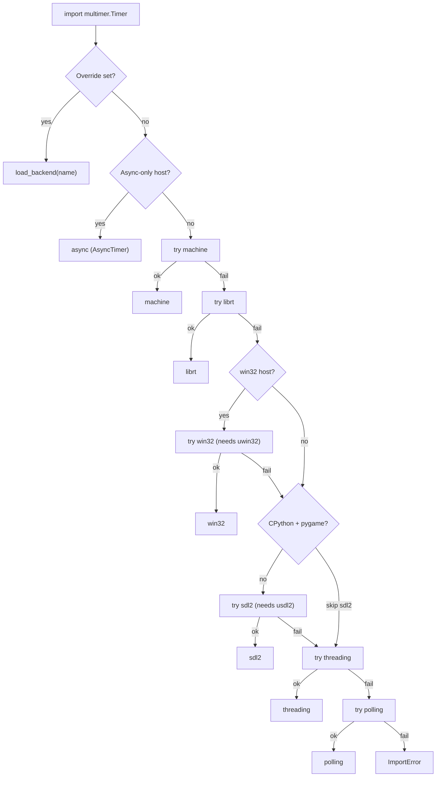

# multimer

Cross-platform periodic timers with a `machine.Timer`-compatible API. One import covers sync timers, async timers, millisecond ticks, sleep, and optional main-loop helpers.

## Public surface

```python
from multimer import (
    Timer,              # sync; platform backend selected at import
    AsyncTimer,         # asyncio/uasyncio software timer
    schedule,           # micropython.schedule-compatible
    sleep_ms,           # Adafruit-style sleep (awaitable inside a running loop)
    ticks_ms,
    ticks_add,
    ticks_diff,
    ticks_less,
    monotonic,
    asyncio,            # lazy: frozen on MP/CP, stdlib on CPython
    backend_name,       # active backend, e.g. "librt"
    backends,           # names accepted by use_backend
    backends_available, # subset of backends() that import on this host
    use_backend,        # override the backend chosen at import
    loop_running,       # True when an asyncio loop is running a coroutine
    uses_signals,       # True when the sync backend needs no sleep pump
    install_asyncio_compat,  # opt-in host-loop-safe asyncio facade
    set_deadline_hook,  # test/debug only
    run_deadline_hook,  # test/debug only
)
```

Mode constants live on the timer class (`Timer.PERIODIC`, `Timer.ONE_SHOT`), not on the module.

There is **no** public queue-drain API; timer backends deliver callbacks without an app-level `pump` step.
App keep-alive lives on `eventsys.Runtime` (`runtime.run_forever()`, `runtime.run()`, `runtime.run_async()`).

## Quick start — sync

```python
import multimer

def on_tick(timer):
    print("tick")

tim = multimer.Timer(-1)
tim.init(mode=multimer.Timer.PERIODIC, period=500, callback=on_tick)

while True:
    # Yield so pump-based backends (SDL2, threading, polling) can deliver.
    multimer.sleep_ms(1)
```

On hosted pydisplay apps, prefer `runtime.run_forever()` (or `runtime.poll()` in a custom loop) instead of a bare busy loop — see [Runtime](runtime.md).

## Quick start — async

```python
import multimer
import board_config
import eventsys
from multimer import asyncio

runtime = eventsys.Runtime.from_board_config(board_config)

async def main():
    tim = multimer.AsyncTimer(-1)
    tim.init(mode=multimer.AsyncTimer.PERIODIC, period=33, callback=on_tick)
    while True:
        handle_events()
        await multimer.sleep_ms(0)

runtime.run_async(main)  # or: asyncio.run(main())
```

No separate loop submodule is required. `AsyncTimer.init()` must run while the event loop is already running (typically inside `async def main()`).

## Convenience

```python
# Context manager
with multimer.Timer(-1) as t:
    t.init(mode=multimer.Timer.PERIODIC, period=100, callback=cb)
    ...
```

Application keep-alive and async entry live on ``eventsys.Runtime``
(``runtime.run_forever()``, ``runtime.run()``, ``runtime.run_async(coro)``) —
see [Runtime](runtime.md).

## Time helpers

MicroPython-compatible names:

- `ticks_ms()`, `ticks_add()`, `ticks_diff()`, `ticks_less()`
- `monotonic()` — monotonic clock (seconds-scale float/int depending on host)
- `sleep_ms(ms)` — blocks in sync code; returns an awaitable when called inside a running asyncio loop (`await multimer.sleep_ms(100)`)

`sleep_ms` is a plain sleep helper. It is **not** an application-facing “drain timers” API.

## `hard` vs soft (`hard=False`)

`Timer.init(..., hard=True|False)` follows MicroPython `machine.Timer` naming:

| `hard` | Path | When the callback runs |
|--------|------|------------------------|
| `True` | Backend delivery calls `callback` directly | Immediately on the delivery path |
| `False` | Delivery goes through `schedule` | Soft coalesce + inter-tick gap always apply |

**Soft only postpones when delivery is off the main thread** (threading worker, polling). On **signal backends** (`multimer.uses_signals()` — Linux librt, on-device `machine.Timer`), the backend already delivers on the main thread; CPython/CircuitPython `schedule` then invokes immediately there. So for *when* the callback runs, soft ≈ hard on librt. Soft still drops piled-up ticks (`_sched_pending` / soft gap). `eventsys.Runtime` ticks use `hard=False` for that coalesce/gap behavior.

The **SDL2** backend always invokes on the VM thread: usdl2 has already marshalled the timer callback there, so a second soft `schedule` hop is skipped (it stalled LVGL under load on `micropython.exe`). Soft coalesce/gap therefore do not apply on sdl2 the way they do on librt/threading.

On MicroPython, soft uses built-in `micropython.schedule` (queue out of a locked-heap ISR) — that *does* defer relative to a hard ISR callback.

## `schedule`

`multimer.schedule(callback, arg)` matches `micropython.schedule` semantics where available. On CPython/CircuitPython, callbacks scheduled from a non-main thread are queued and run on the main thread when `schedule` / loop helpers next run pending work. On the main thread — including librt RT-signal delivery — pending work is drained and `callback(arg)` runs immediately. Prefer keeping timer callbacks on the main thread (the default backends aim for that).

## Development / troubleshooting — deadline hooks

!!! warning "Not for application code"
    `set_deadline_hook` / `run_deadline_hook` exist only for **test harnesses and
    interactive debugging**. Leave them unset in production apps, and expect to
    use them only from test/debug tooling that already understands your host's
    threading model (notably single-threaded browser WASM).

Some hosts are single-threaded (notably browser WASM / PyScript): a sync
`while True` loop that calls `sleep_ms` holds the main thread, so a background
timer cannot inject “please quit.” For bounded smoke tests, register a
cooperative deadline hook instead:

```python
import multimer

def on_deadline():
    # e.g. set a quit flag your loop already checks
    runtime.request_quit()
    return True

multimer.set_deadline_hook(on_deadline)
try:
    run_demo()
finally:
    multimer.set_deadline_hook(None)  # always clear when done
```

| API | Role |
|-----|------|
| `set_deadline_hook(hook)` | Register a zero-arg callable, or `None` to clear |
| `run_deadline_hook()` | Invoke the hook if set; returns its result or `False` |
| `sleep_ms` | Calls `run_deadline_hook()` before and after sleeping |

`eventsys.Runtime.poll()` also calls `run_deadline_hook()` so loops that poll
without sleeping still hit the deadline. Application demos should keep using
normal quit handling (`runtime.quit_requested`); only harness code should
install a hook.

## Async helpers

| Function | Purpose |
|----------|---------|
| `AsyncTimer` | Software timer backed by asyncio/uasyncio |
| `asyncio` | Lazy-loaded event-loop module |
| `loop_running` | True when a loop is running *and* executing a coroutine |

Keep-alive / async app entry: `eventsys.Runtime.run_forever` / `run` / `run_async`.

Use `loop_running()` to decide whether an `AsyncTimer` can be created yet — it is
the only check that answers correctly everywhere. Do not hand-roll it:
`get_running_loop` is missing from uasyncio and succeeds on CircuitPython with no
loop running, and `get_event_loop` creates a loop rather than reporting one, so
both report a loop that is not there (or miss one that is).

## FAQ — callback did not fire

1. **Main loop never yields** — call `sleep_ms` or `runtime.poll()` so pump-based backends (SDL2, threading, polling) can deliver.
2. **Async timer** — event loop must be running at `init()`; await something each loop (`await sleep_ms(0)`).
3. **Timer deinited** — one-shot and `deinit()` stop callbacks.
4. **Exception in callback** — exceptions propagate from the delivery path; fix the callback or catch inside it.

## pydisplay integration

When selected, `eventsys.Runtime` owns the application's shared periodic timer
(`on_tick` and hosted display refresh). Apps normally use `runtime.poll()` or
`run_forever()` rather than allocating another refresh timer. LVGL instead owns
its tick/task timer through `display_driver`. Use `Timer` when
`runtime.timer_async` is false and `AsyncTimer` when it is true. See
[Runtime](runtime.md) and [Displays — timing](displays.md#timing).

## Internals (contributors)

Backend selection for sync `Timer` (first importable match wins):

1. Env override: `MULTIMER_BACKEND` / `use_backend(name)`
2. Async-only host (PyScript / Jupyter) → `async` (`AsyncTimer` as `Timer`)
3. Auto chain: **`machine` → `librt` → `win32` → `sdl2` → `threading` → `polling`**,
   with **`win32` omitted off Windows** and **`sdl2` omitted on CPython when pygame imports** (see tables).

### Selection flow


```mermaid
flowchart TB
  start["import multimer.Timer"]
  override{"Override set?"}
  bind["load_backend(name)"]
  async_q{"Async-only host?"}
  async_b["async (AsyncTimer)"]
  try_machine["try machine"]
  machine["machine"]
  try_librt["try librt"]
  librt["librt"]
  skip_win32{"win32 host?"}
  try_win32["try win32 (needs uwin32)"]
  win32b["win32"]
  skip_sdl2{"CPython + pygame?"}
  try_sdl2["try sdl2 (needs usdl2)"]
  sdl2["sdl2"]
  try_threading["try threading"]
  threading["threading"]
  try_polling["try polling"]
  polling["polling"]
  fail["ImportError"]

  start --> override
  override -->|yes| bind
  override -->|no| async_q
  async_q -->|yes| async_b
  async_q -->|no| try_machine
  try_machine -->|ok| machine
  try_machine -->|fail| try_librt
  try_librt -->|ok| librt
  try_librt -->|fail| skip_win32
  skip_win32 -->|no| skip_sdl2
  skip_win32 -->|yes| try_win32
  try_win32 -->|ok| win32b
  try_win32 -->|fail| skip_sdl2
  skip_sdl2 -->|skip sdl2| try_threading
  skip_sdl2 -->|no| try_sdl2
  try_sdl2 -->|ok| sdl2
  try_sdl2 -->|fail| try_threading
  try_threading -->|ok| threading
  try_threading -->|fail| try_polling
  try_polling -->|ok| polling
  try_polling -->|fail| fail
```

Override raises when the named backend cannot import (no silent fallback). On CPython, auto-selection skips `sdl2` when pygame is importable so `PGDisplay` does not share a process with usdl2 timers. **`micropython.exe` without usdl2** has no `threading` and lands on **`polling`**.

### Backend roles

| Backend | Typical hosts | Notes |
|---------|---------------|-------|
| `machine` | MCU MicroPython / CircuitPython | Preferred when `machine.Timer` exists (desktop unix MP/CP builds usually lack it) |
| `librt` | Linux CPython / MicroPython unix | `timer_create`; main-thread signals. Not available on CircuitPython unix or Windows |
| `win32` | Windows CPython with `uwin32` | Waitable timer + APC; `SleepEx` alertable wait. Auto-tried only on `win32`. Not for `micropython.exe` |
| `sdl2` | Desktop usdl2 (MP, CP, and CPython without pygame) | `SDL_AddTimer`; pump via `SDL_PumpEvents`. Needs the `usdl2` module (frozen, wheel, or pure-Python). On CPython, skipped when pygame is importable so auto selection matches `AutoDisplay` (`PGDisplay`) and avoids usdl2+pygame dual-SDL deadlock. With pygame installed, use `MULTIMER_BACKEND=sdl2` only if the window is usdl2/`SDLDisplay` |
| `threading` | Hosts with `_thread`/`threading` and no higher match | Worker + main-thread `schedule`. **Not** available on `micropython.exe` today |
| `polling` | Last resort — notably **`micropython.exe` without usdl2** | Cooperative; advanced by `sleep_ms` / drain. Kept so `import multimer` still binds a sync timer when `machine` / `librt` / `sdl2` / `threading` are all unavailable |
| `async` | PyScript / Jupyter (auto); anywhere via override | `AsyncTimer` as `Timer` |

### Desktop auto-selection matrix

Timer choice is decided at `import multimer`. It does **not** require opening a window. GUI harnesses (for example `lv_test_timer`) still need a display driver, so without usdl2 every **SDLDisplay** path fails before a timer cell can be reported — while a console app on the same runtime still gets the timer below.

| Runtime | pygame-ce | usdl2 | GUI display | GUI status | Timer (GUI or console) |
|---------|-----------|-------|-------------|------------|------------------------|
| `cpython-venv` (Linux) | yes | yes or no | `PGDisplay` | ok | **`librt`** |
| `cpython-venv` (Linux) | no | yes | `SDLDisplay` | ok | **`librt`** |
| `cpython-venv` (Linux) | no | no | — | fail: no usdl2 | **`librt`** (console) |
| `micropython` (Linux) | n/a | yes | `SDLDisplay` | ok | **`librt`** |
| `micropython` (Linux) | n/a | no | — | fail: no usdl2 | **`librt`** (console) |
| `circuitpython` (Linux) | n/a | yes | `SDLDisplay` | ok | **`sdl2`** |
| `circuitpython` (Linux) | n/a | no | — | fail: no usdl2 | **`threading`** (console; has `_thread`) |
| `micropython.exe` | n/a | yes | `SDLDisplay` | ok | **`sdl2`** |
| `micropython.exe` | n/a | no | — | fail: no usdl2 | **`polling`** (console; no `threading` on this port) |
| `python.exe` | yes or no | yes or no | `WinDisplay` (needs `uwin32`) | ok | **`win32`** |
| `python.exe` | yes | yes or no | `PGDisplay` if `uwin32` missing | ok | **`threading`** |
| `python.exe` | no | yes | `SDLDisplay` if `uwin32` missing | ok | **`sdl2`** |
| `python.exe` | no | no | — | fail: no usdl2 | **`threading`** if `uwin32` missing (console) |

GUI rows with usdl2 (and the pygame-only no-usdl2 rows) match `tools/lv_timer_test_kit.py --modes sync` / `KIT_RESULT.backend`. Console rows without usdl2 are from the same auto chain plus `backends_available()` on each host — especially **`micropython.exe` → `polling`**, which is why that backend stays in the product.

`backends()` is the accept-list for overrides (auto order + `async`). It is **not** the try-order alone — that is `AUTO_BACKENDS` / `_auto_backends()` in `_select.py`. `backends_available()` probes which names import on the current host.

`tools/test_timers.py` probes public timers on the host. Run `python tools/run_test_timers.py` for a per-runtime matrix. Private backend probing is opt-in (`MULTIMER_PROBE_BACKENDS=1`).

### Overriding the backend

`multimer.backend_name()` reports the active choice; `multimer.use_backend(name)` replaces it and rebinds `Timer` and `sleep_ms`. Accepted names are `machine`, `librt`, `win32`, `sdl2`, `threading`, `polling`, and `async` (`AsyncTimer`) — the same list `multimer.backends()` returns. Setting `MULTIMER_BACKEND` applies one at import instead.

An override that this host cannot provide raises `ImportError` (and an unknown name `ValueError`) rather than falling back, so a bad value can never be mistaken for the platform default. Call `use_backend` before creating timers.

To compare backends on the same example across runtimes:

```bash
python tools/lv_timer_test_kit.py --backend sdl2
```

That routes each child through `tools/multimer_backend_preload.py`, which calls `use_backend` in-process — necessary because Windows `micropython.exe` / `python.exe` launched from WSL cannot read exported environment variables. Runtimes without the requested backend report `unavailable` instead of failing.

### librt backend

Linux **`timer_create`** / **`timer_settime`** with thread-directed signals (`SIGEV_THREAD_ID`). Callbacks run on the main thread (often inside the RT signal handler). Soft (`hard=False`) still runs there via immediate `schedule` — see [hard vs soft](#hard-vs-soft-hardfalse).

### SDL2 bindings (`usdl2`)

Desktop SDL2 access is shared between display and timer code:

| Consumer | Import chain |
|----------|--------------|
| `displaydev.sdldisplay` | built-in / env `usdl2` → desktop board / `pydevices-desktop` |
| `multimer` SDL backend | `usdl2` (native or pure-Python desktop binding) |

Both prefer a native **`usdl2`** module when it is frozen or already present. Otherwise the pure-Python binding from [`pydevices-desktop`](https://pydevices.github.io/micropython-hardware/pydevices-desktop.html) / the MIP desktop board (`drivers/usdl2.py`) provides `import usdl2`. See [Displays — SDLDisplay](displays.md#sdldisplay) and [MicroPython — Desktop SDL](../platforms/micropython.md#desktop-sdl-usdl2).

## Next

- [Runtime](runtime.md)
- [Displays — timing](displays.md#timing)
- [Events](events.md)
- [PyScript asyncio](../guides/pyscript-asyncio.md)
