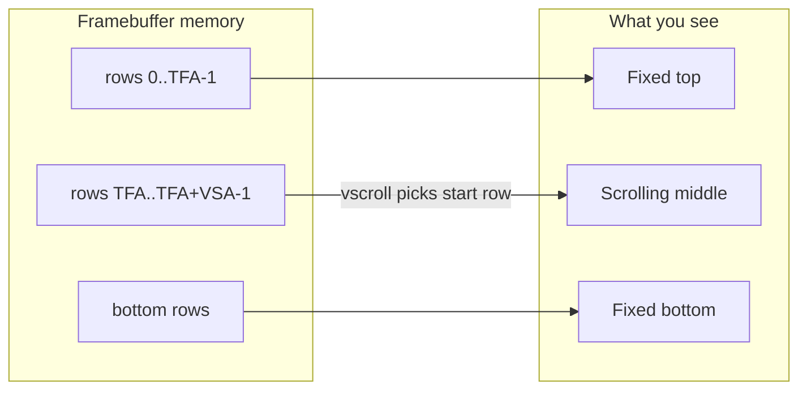

# pydisplay_demo

!!! tip "Need a minimal template?"
    Copy the [**App starter**](app-starter.md) boilerplate to begin your first app without rotation or scrolling.

[`pydisplay_demo.py`](https://github.com/PyDevices/pydisplay/blob/main/src/examples/pydisplay_demo.py) is the recommended feature demo for pydisplay. It is a single file that uses only **`src/lib`** modules — no `add_ons`, no `tft_config`, no `displaybuf`.

It demonstrates:

- **Display** — drawing through `board_config.display_drv`
- **Input** — touch or mouse clicks via `eventsys` and `graphics.Area`
- **Rotation** — `display_drv.rotation` in 90° steps
- **Hardware-style scrolling** — fixed top/bottom chrome with a scrolling middle panel
- **Timers** — `multimer.Timer` with a `run_forever` / poll main loop

Desktop-oriented sync demo (not in the PyScript gallery; see the async variant below).

## Run it

From a [full clone](../installation/full-clone.md) with `board_config` on your path:

```python
import lib.path   # adds lib/, examples/ to sys.path
import pydisplay_demo
```

Desktop (SDL board config):

```bash
cd src
PYTHONPATH=../board_configs/sdldisplay:lib micropython -i lib/path.py
```

```python
>>> import pydisplay_demo
```

On MCU, install the matching [board config](../hardware/board-configs.md), copy or symlink it as `board_config.py`, and run the script from `main.py` or the REPL the same way.

**Interact:** tap or click **Rotate** and **Color** in the top bar. The tips list in the middle scrolls automatically.

## Screen layout

The display is split into three vertical bands. Only the middle band scrolls; the top and bottom stay fixed on screen.

```
┌─────────────────────────────┐
│ TOP (36 px) — fixed         │
│  [ Rotate ]  [ Color ]      │
├─────────────────────────────┤
│                             │
│  Scroll area (VSA)          │  ← tips list; offset changes via vscroll
│                             │
├─────────────────────────────┤
│ BOT (20 px) — fixed         │
│  rot 0                      │
└─────────────────────────────┘
```

Constants in the script: `TOP = 36`, `BOT = 20`, `ROW = 20` (height of each tip line), `ACCENT = 4` (colored stripe at the left of each row).

## Modules used

| Import | Role |
|--------|------|
| `board_config.display_drv` | Platform display driver (SDL, BusDisplay, …) |
| `board_config.runtime` | Input event runtime (touch / mouse) |
| `displaysys.color565` | RGB → RGB565 color values |
| `graphics.Area` | Rectangle hit-testing for buttons |
| `graphics.Font`, `FrameBuffer`, `RGB565` | Text rendered in RAM, blitted once |
| `multimer.Timer`, `run_forever`, `sleep_ms` | Periodic scroll + main loop |

## Code walkthrough

### Palette and content

The demo uses a dark Cursor-inspired palette (black canvas, cream text, orange default accent). `ACCENTS` holds six colors cycled by the **Color** button. `TIPS` is the scrolling welcome text.

Runtime state lives in a small `state` dict:

- `rotation` — 0, 90, 180, or 270
- `scroll` — pixel offset inside the scroll area (0 … `vsa - 1`)
- `color_i` — index into `ACCENTS`

`rotate_btn` and `color_btn` are `Area` instances recreated on each `redraw()` so click coordinates can be tested with `area.contains(event.pos)`.

### Text: framebuffer + one blit per string

Drawing text directly on `display_drv` with `text16()` issues one `fill_rect` per font pixel — fine for tiny labels, slow for a full list.

The demo follows [`font_simpletest.py`](https://github.com/PyDevices/pydisplay/blob/main/src/examples/font_simpletest.py):

1. Allocate a reusable `_TEXT_BUF` sized for the longest tip line.
2. Wrap a slice in `FrameBuffer`, fill the background, call `FONT.text()` into RAM.
3. Push the whole glyph block with a single `display_drv.blit_rect()`.

```python
def blit_text(s, x, y, fg, bg):
    w = len(s) * FONT.width
    h = FONT.height
    buf = memoryview(_TEXT_BUF)[: w * h * BPP]
    fb = FrameBuffer(buf, w, h, RGB565)
    fb.fill(bg)
    FONT.text(fb, s, 0, 0, fg)
    display_drv.blit_rect(buf, x, y, w, h)
```

`Font(height=16)` uses the built-in 8×16 romfont from `graphics` — no extra font files required.

### `redraw()` — full paint pass

`redraw()` runs after startup and whenever rotation or accent color changes.

1. Save `state["scroll"]`.
2. Set `display_drv.vscroll = 0` so all drawing uses stable coordinates (see [Drawing while scrolled](#drawing-while-scrolled) below).
3. Clear to black; draw top buttons, tip rows, bottom status bar.
4. Restore `vscroll` and call `display_drv.show()` once.

Scroll is **paused** (`_scroll_paused`) during `redraw()` so the timer cannot advance the scroll offset while pixels are being written.

### Startup and main loop

```python
def main():
    setup_scroll()
    redraw()
    periodic(on_tick, period=40, warn=False)
    run_forever(handle_events)

main()
```

- **`setup_scroll()`** — calls `display_drv.set_vscroll(TOP, BOT)` to define fixed regions.
- **`periodic(on_tick, period=40)`** — allocates the next timer id after `display_drv` (SDLDisplay `auto_refresh` already took id 1 via `periodic(show, …)`). No need to pick a timer number yourself.
- **`on_tick(_=None)`** — every 40 ms, increments `state["scroll"]` and sets `display_drv.vscroll`. The optional timer argument matches the `machine.Timer` / `periodic` callback contract.
- **`run_forever(handle_events)`** — cooperative main loop that polls input and yields to the timer backend ([multimer](../concepts/multimer.md)).
- **`runtime.poll()`** (inside `handle_events`) — returns touch/mouse events; the demo handles `MOUSEBUTTONDOWN` only.

**Rotate** pauses scroll, updates `display_drv.rotation`, resets scroll to 0, calls `setup_scroll()` and `redraw()`, then resumes scroll.

**Color** pauses scroll, advances `color_i`, `redraw()`, resumes scroll.

`periodic()` in [`multimer`](../concepts/multimer.md) hands out the next available timer id (`-1` on RP2). pydisplay drivers use it for `auto_refresh`, so app timers created afterward do not collide.

---

## How scrolling works

Many TFT controllers (and pydisplay’s SDL desktop driver) mimic the **ILI9341-style vertical scroll** model. The framebuffer is treated as a cylinder: you define which rows are “fixed” on screen and which rows form a **scroll window**, then you change **where that window starts** in GRAM without redrawing every pixel.

### Three regions: TFA, VSA, BFA

| Term | Meaning | In this demo |
|------|---------|----------------|
| **TFA** | Top fixed area — rows always shown at the top of the screen | `TOP` (36 px) — buttons |
| **VSA** | Vertical scroll area — content that can move | middle band |
| **BFA** | Bottom fixed area — rows always shown at the bottom | `BOT` (20 px) — status |

They must sum to the display height:

```text
TFA + VSA + BFA = height
```

`set_vscroll(TOP, BOT)` is the convenient API:

```python
display_drv.set_vscroll(TOP, BOT)
# equivalent to:
# display_drv.vscrdef(TOP, height - TOP - BOT, BOT)
# display_drv.vscroll = 0
```

After rotation, call `setup_scroll()` again — `display_drv.rotation` runs `init()` on the driver, which resets scroll state.

### Scroll address: `vscsad` and `vscroll`

- **`vscsad(address)`** — sets the vertical scroll **start address** in the framebuffer (absolute row in GRAM).
- **`vscroll`** (property) — scroll position **relative to the scroll area**, in pixels from the top of the VSA:

```python
display_drv.vscroll = n   # sets vscsad((n % vsa) + tfa)
```

The demo keeps a logical offset in `state["scroll"]` and assigns it in `on_tick`:

```python
state["scroll"] = (state["scroll"] + 1) % scroll_height()
display_drv.vscroll = state["scroll"]
```

where `scroll_height()` returns `display_drv.vsa`.

Physically, increasing `vscroll` shifts which slice of GRAM appears in the middle band — the top and bottom fixed regions stay pinned.



On **SDLDisplay**, `render()` copies the texture in sections (top fixed, scroll top, scroll wrap, bottom fixed) so software scrolling matches the hardware model. On **BusDisplay**, the driver sends `VSCRDEF` / `VSCSAD` commands to the panel.

### Drawing while scrolled

When `vscroll > 0`, the driver’s idea of “what appears where” differs from raw `(x, y)` drawing coordinates. If you `fill_rect` while scrolled, partial updates can land in the wrong place or look corrupted.

**Rule used in this demo:** before any redraw, set `display_drv.vscroll = 0`, draw the whole UI, restore the saved offset, then `show()`.

Also **pause the scroll timer** during redraw. If `on_tick` runs in the middle of `redraw()`, it can advance `vscroll` while rows are still being written — the middle panel looked “pixelated” until scroll was paused and draw-at-zero was enforced.

### Relation to other examples

| Example | What it adds |
|---------|----------------|
| [`scroll_touch_test.py`](https://github.com/PyDevices/pydisplay/blob/main/src/examples/scroll_touch_test.py) | Manual scroll with touch Up/Down in fixed bars |
| [`eventsys_encoder_test.py`](https://github.com/PyDevices/pydisplay/blob/main/src/examples/eventsys_encoder_test.py) | `vscsad` driven by a rotary encoder |
| [`scroll.py`](https://github.com/PyDevices/pydisplay/blob/main/src/examples/scroll.py) | Full-screen hardware scroll (`tft_config` stack) |
| [`font_simpletest.py`](https://github.com/PyDevices/pydisplay/blob/main/src/examples/font_simpletest.py) | Font + `FrameBuffer` + `blit_rect` pattern |

## multimer in this demo

This script is intentionally **not** a multimer test, but it uses the default timer the way many real apps should:

```python
run_forever(handle_events)  # poll input; timer callbacks run on the active backend
```

See [multimer](../concepts/multimer.md) for timer backends and `timer_async`.

## Async variant

[`pydisplay_demo_async.py`](https://github.com/PyDevices/pydisplay/blob/main/src/examples/pydisplay_demo_async.py) is the same demo with an **asyncio** main loop and **`multimer.AsyncTimer`** for scrolling (`# pyscript gallery: async`). Use it on PyScript or any port where the app already runs under `asyncio` / `uasyncio`:

```python
import lib.path
import pydisplay_demo_async
```

The script runs on PyScript/Jupyter where `runtime.timer_async` is true, starts the scroll timer inside `async def main()` (required for `aio.Timer.init`), and yields with `await asyncio.sleep(...)` / `run_forever_async` each frame. UI, colours, scroll pause during redraw, and buffered text are unchanged.

To migrate from sync to async, compare the two entrypoints side by side:

| Sync (`pydisplay_demo`) | Async (`pydisplay_demo_async`) |
|-------------------------|------------------------------|
| `def main():` | `async def main_async():` |
| `from multimer.loop import run_forever` | `dual_main` / `run_forever_async` |
| `periodic(on_tick, period=40, warn=False)` | `periodic(on_tick, period=40, async_=True, warn=False)` |
| `run_forever(handle_events)` | `await run_forever_async(handle_events, …)` |
| `main()` at bottom | `dual_main(...)` at bottom |

## Related docs

- [Board configs](../hardware/board-configs.md) — choose and customize `board_config.py`
- [Events](../concepts/events.md) — `runtime.poll()` and device types
- [Displays](../concepts/displays.md) — driver overview and rotation notes
- [Examples catalog](index.md) — full list of scripts
