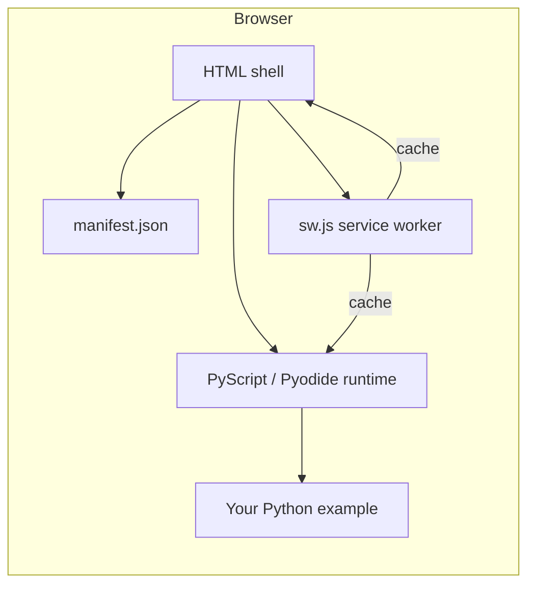

# Make your PyScript app a Progressive Web App (PWA)

**Who:** You host a pydisplay (or other PyScript) demo on GitHub Pages — or any HTTPS origin — and want users to install it like a native app and run it offline after the first visit.

**Where PWAs run:** Platform notes — host matrix, install UX, PWA vs Android APK — live in [Progressive Web Apps](../platforms/pwa.md). This guide is the **how-to** (manifest, service worker, deploy).

**Prerequisites:** A working PyScript HTML shell (see [PyScript guide](pyscript.md)). Basic familiarity with browser DevTools.

**Live reference:** The [pydisplay PyScript gallery](https://pydevices.github.io/pydisplay/pyscript/) is a PWA. Open DevTools → **Application** to inspect its manifest and service worker, or click **Install app** in the header.

---

## What a PWA is (and what Python does)

A **Progressive Web App** is still a website. Browsers treat it as installable when three pieces are in place:

| Requirement | Purpose |
|-------------|---------|
| **HTTPS** (or `localhost` for dev) | Secure origin; required for service workers |
| **Web app manifest** (`manifest.json`) | Name, icons, theme colors, launch URL, display mode |
| **Service worker** (`sw.js`) | Background script that can cache assets and enable offline use |

Python runs **inside** the page via PyScript/Pyodide. It does not replace the manifest or service worker — those are standard web files served alongside your HTML.



---

## PyScript-specific constraints

PyScript demos are heavier than typical static sites. Plan for these up front.

### SharedArrayBuffer needs Cross-Origin Isolation (COI)

MicroPython and Pyodide in the browser often need `SharedArrayBuffer`. That requires **cross-origin isolated** pages (`Cross-Origin-Opener-Policy` and `Cross-Origin-Embedder-Policy` headers).

GitHub Pages does **not** send those headers by default. The pydisplay gallery solves this in **one** service worker (`web/pyscript/sw.js`) that:

1. Intercepts fetches and adds COI headers to responses.
2. Caches gallery assets for offline use.

!!! important "One service worker per scope"
    A given URL path can only have **one** active service worker. If you already register a worker (for example `mini-coi-fd.js` for COI), merge COI and PWA caching into a single `sw.js` instead of registering two scripts.

### Register the worker before PyScript boots

COI must be active before the runtime tries to allocate `SharedArrayBuffer`. Load `pwa.js` **synchronously in `<head>`**, before `vendor/core.js`:

```html
<script src="./pwa.js"></script>
<script type="module" src="./vendor/core.js"></script>
```

Do **not** use `defer` on `pwa.js` for loader pages (`micropython.html`, `pyodide.html`).

### Offline caching is large

A first online visit downloads PyScript/Pyodide `.wasm` bundles and any packages your demo imports from CDNs. The service worker caches those on the fly. Storage can reach tens to hundreds of MB per demo.

Use **stale-while-revalidate** (serve cache immediately, refresh in background) rather than precaching every runtime file at install time — precaching everything often hits browser storage limits on first load.

---

## Files you need

For a pydisplay-style deployment under `web/pyscript/`, these are the PWA files in this repository:

| File | Role |
|------|------|
| [`manifest.json`](https://github.com/PyDevices/pydisplay/blob/main/web/pyscript/manifest.json) | Install metadata |
| [`sw.js`](https://github.com/PyDevices/pydisplay/blob/main/web/pyscript/sw.js) | COI headers + offline cache |
| [`pwa.js`](https://github.com/PyDevices/pydisplay/blob/main/web/pyscript/pwa.js) | Register `sw.js`, install button, offline toast |
| [`pwa.css`](https://github.com/PyDevices/pydisplay/blob/main/web/pyscript/pwa.css) | Styles for install button and toast |
| `icon-192.png`, `icon-512.png` | Launcher icons (PNG; manifest requires raster icons) |

Gallery pages that include the full PWA UI: `index.html`, `micropython.html`, `pyodide.html`. Minimal shells (`simple.html`, `repl.html`, `embed.html`) link the manifest and load `pwa.js` without the install button.

---

## Step 1 — Create `manifest.json`

Place `manifest.json` next to your HTML entry point (same directory or adjust paths).

### Gallery app (many demos, one install icon)

Use when users install the **whole demo hub** and pick a demo from the grid:

```json
{
  "name": "PyDevices pydisplay",
  "short_name": "pydisplay",
  "description": "Cross-platform display and event drivers — PyScript demos in your browser.",
  "start_url": "./index.html",
  "scope": "./",
  "display": "standalone",
  "launch_handler": {
    "client_mode": "navigate-existing"
  },
  "background_color": "#100e0b",
  "theme_color": "#f54e00",
  "icons": [
    {
      "src": "icon-192.png",
      "sizes": "192x192",
      "type": "image/png",
      "purpose": "any"
    },
    {
      "src": "icon-512.png",
      "sizes": "512x512",
      "type": "image/png",
      "purpose": "any"
    },
    {
      "src": "icon-512.png",
      "sizes": "512x512",
      "type": "image/png",
      "purpose": "maskable"
    }
  ]
}
```

### Single-demo app (one install icon opens one module)

Use when the installed app should **always** launch the same demo, including query parameters:

```json
{
  "name": "pydisplay demo",
  "short_name": "Demo",
  "description": "Flagship pydisplay board_config demo in the browser.",
  "start_url": "./micropython.html?modules=pydisplay_demo",
  "scope": "./",
  "display": "standalone",
  "launch_handler": {
    "client_mode": "navigate-existing"
  },
  "background_color": "#100e0b",
  "theme_color": "#f54e00",
  "icons": [
    { "src": "icon-192.png", "sizes": "192x192", "type": "image/png" },
    { "src": "icon-512.png", "sizes": "512x512", "type": "image/png" }
  ]
}
```

!!! tip "`start_url` and `scope`"
    - **`scope`** — URL prefix the PWA owns. Usually `"./"` for everything under `web/pyscript/`.
    - **`start_url`** — page opened when the user taps the home-screen icon. Include `?modules=` or `?manifests=` when you want a fixed entry demo.
    - Paths are relative to the manifest file location.

### Icons

Provide at least **192×192** and **512×512** PNG files. Maskable icons (safe zone in the center) improve Android adaptive icons.

You can adapt the [PyDevices logo SVG](https://github.com/PyDevices/pydisplay/blob/main/web/vendor/pydevices-chrome/logo.svg) or export PNGs from any design tool. The gallery icons live at `web/pyscript/icon-192.png` and `web/pyscript/icon-512.png`.

---

## Step 2 — Create `sw.js` (service worker)

The service worker runs in the background. It can cache responses and, for PyScript, inject COI headers.

### Minimal structure

1. **`install`** — precache a small **shell** of HTML/CSS/JS you control (not the entire Pyodide tree).
2. **`activate`** — delete caches from older versions when you bump `CACHE_NAME`.
3. **`fetch`** — cache-first with background revalidation for your origin and known CDN hosts; add COI headers where needed.

Key constants from the pydisplay worker:

```javascript
const CACHE_NAME = 'pydisplay-pwa-dev';  // stamped at Pages deploy (see below)

const STATIC_ASSETS = [
  './index.html',
  './micropython.html',
  './manifest.json',
  './icon-192.png',
  './icon-512.png',
  './site.css',
  './pwa.js',
  // add your shell files; avoid listing every vendor/*.js
];

const RUNTIME_ORIGINS = [
  'pyscript.net',
  'cdn.jsdelivr.net',
  'pyodide.org',
  'pydevices.github.io',
];
```

### COI header helper

```javascript
function withCoiHeaders(response) {
  const { body, status, statusText } = response;
  if (!status || status > 399) return response;
  const headers = new Headers(response.headers);
  headers.set('Cross-Origin-Opener-Policy', 'same-origin');
  headers.set('Cross-Origin-Embedder-Policy', 'require-corp');
  headers.set('Cross-Origin-Resource-Policy', 'cross-origin');
  return new Response(status === 204 ? null : body, { status, statusText, headers });
}
```

Apply `withCoiHeaders` to **same-origin** responses (and shell assets) so `SharedArrayBuffer` works after the worker controls the page.

### Caching strategy

| Asset type | Strategy |
|------------|----------|
| Your HTML, CSS, `manifest.json`, icons | Precache in `install` + stale-while-revalidate |
| `vendor/` PyScript bundles | Cache on first network fetch; do not `cache.addAll` the whole tree |
| CDN packages (jsDelivr, pyscript.net, …) | Stale-while-revalidate per request URL |
| POST / non-GET | Do not cache |

### `CACHE_NAME` stamping at deploy

Git keeps `CACHE_NAME = 'pydisplay-pwa-dev'` in `web/pyscript/sw.js`. The
[Deploy PyScript site to GitHub Pages](https://github.com/PyDevices/pydisplay/blob/main/.github/workflows/deploy-pyscript.yml)
workflow runs [`scripts/pyscript_stamp_pwa_cache.py`](https://github.com/PyDevices/pydisplay/blob/main/scripts/pyscript_stamp_pwa_cache.py)
on the assembled `_site/pyscript/` tree **before** publishing to `gh-pages`. The
script hashes `STATIC_ASSETS` plus the service-worker source and rewrites
`CACHE_NAME` to `pydisplay-pwa-<hash>` (12 hex chars).

That means:

- **Shell changes** (HTML/CSS/PWA files listed in `STATIC_ASSETS`, or `sw.js`
  logic) produce a new cache id → `activate` deletes older caches → installed
  PWAs see fresh shell content and `pwa.js` can prompt **Reload**.
- **Example / `src/` churn alone** does **not** change the hash — gallery card
  updates do not nag installed users on every push. Stale-while-revalidate still
  refreshes pages in the background.

Local `python tools/serve.py` uses the git copy (`pydisplay-pwa-dev`); only the
Pages artifact is stamped.

See the full implementation: [`web/pyscript/sw.js`](https://github.com/PyDevices/pydisplay/blob/main/web/pyscript/sw.js).

---

## Step 3 — Link the manifest and register the worker

In every HTML page that should participate in the PWA, add to `<head>`:

```html
<link rel="manifest" href="./manifest.json">
<meta name="theme-color" content="#f54e00">
<link rel="apple-touch-icon" href="./icon-192.png">
<link rel="stylesheet" href="./pwa.css">
<script src="./pwa.js"></script>
```

`pwa.js` registers `./sw.js` immediately (required for COI) and wires optional UI when elements exist.

Gallery demo cards intentionally omit `target="_blank"`. Chromium treats same-scope `_blank` navigations from an installed PWA as a **new app window**; same-tab links keep demos in one window (browser or installed app). The manifest also sets `launch_handler.client_mode` to `navigate-existing` so captured launches reuse the recent PWA window. `pwa.js` still rewrites any leftover same-origin `_blank` clicks to in-place navigation. External links (Docs, GitHub, …) may keep `_blank`.

### Install button (optional)

Add a button anywhere in your layout (the gallery puts it in the header):

```html
<button type="button" class="pwa-install-btn" id="pwa-install-btn">Install app</button>
```

`pwa.js` shows the button when Chromium fires `beforeinstallprompt`, or on iOS (Safari and other WebKit browsers) when the page is not already running as a home-screen app. Chromium then calls `prompt()`; on iOS the button opens a short **Share → Add to Home Screen** tip (Safari has no programmatic install API).

### Offline toast (optional)

No extra HTML is required. `pwa.js` creates a `#pwa-toast` element on first use and shows messages when:

- the service worker finishes its first activation;
- the browser goes online or offline.

Styles are in [`pwa.css`](https://github.com/PyDevices/pydisplay/blob/main/web/pyscript/pwa.css).

---

## Step 4 — Deploy

### GitHub Pages (this repo)

Pushes to `main` that touch `web/**` or `src/**` run [Deploy PyScript site to GitHub Pages](https://github.com/PyDevices/pydisplay/blob/main/.github/workflows/deploy-pyscript.yml). The workflow:

1. Verifies generated manifests are fresh (`install_refresh_manifests.sh --audit`, `gallery_generator.py --check`).
2. Copies `web/pyscript/*` into `_site/pyscript/`.
3. Copies `src/lib`, `src/add_ons`, and examples into `_site/pyscript/src/`.
4. Stamps `CACHE_NAME` in `_site/pyscript/sw.js` from shell content
   (`pyscript_stamp_pwa_cache.py`).
5. Publishes to the `gh-pages` branch.

Before pushing PWA changes, refresh gallery metadata locally:

```bash
./scripts/install_refresh_manifests.sh
python scripts/gallery_generator.py
```

Commit any updated `packages/*.json` files the scripts produce.

### Other hosts

Any static host works if:

- HTTPS is enabled (Let's Encrypt, Cloudflare, GitHub Pages, etc.).
- `manifest.json`, `sw.js`, and icons are served from the same scope as your HTML.
- `sw.js` is served with `Content-Type: application/javascript` (default on most hosts).

---

## Step 5 — Test installability and offline use

Use Chrome or Edge on desktop, Chrome on Android, or Safari on iOS. On iOS the **Install app** button explains **Share → Add to Home Screen** (Safari never fires `beforeinstallprompt`).

### Checklist

1. **Manifest**
   - DevTools → **Application** → **Manifest**
   - No errors; icons and `start_url` resolve.

2. **Service worker**
   - DevTools → **Application** → **Service Workers**
   - `sw.js` is activated and controls the page (may require one reload on first visit for COI).

3. **Install**
   - Look for the install icon in the address bar, or your **Install app** button.
   - If you tested an install earlier, **uninstall** the PWA first — browsers suppress `beforeinstallprompt` for already-installed origins.

4. **Offline**
   - Open your demo **once online** and click **Run** so Pyodide/MicroPython and packages download.
   - DevTools → **Network** → enable **Offline**.
   - Reload. The shell and cached runtime should still load; uncached assets fail until you go back online.

5. **COI / SharedArrayBuffer**
   - DevTools → **Console**: no `SharedArrayBuffer` errors after the COI reload cycle.
   - **Application** → check that cross-origin isolation is active (or verify `crossOriginIsolated === true` in the console).

### Example URLs (live gallery)

| Page | URL |
|------|-----|
| Gallery (PWA home) | [pyscript/](https://pydevices.github.io/pydisplay/pyscript/) |
| Flagship demo | [micropython.html?modules=pydisplay_demo](https://pydevices.github.io/pydisplay/pyscript/micropython.html?modules=pydisplay_demo) |
| Calculator | [micropython.html?modules=calc_graphics,calc_engine](https://pydevices.github.io/pydisplay/pyscript/micropython.html?modules=calc_graphics,calc_engine) |

---

## Adapting for your own project

### Fork or copy the PWA bundle

1. Copy `manifest.json`, `sw.js`, `pwa.js`, `pwa.css`, and icon PNGs into your `web/pyscript/` tree (or equivalent).
2. Edit `manifest.json` — name, colors, `start_url`.
3. Edit `STATIC_ASSETS` in `sw.js` — list only pages and styles **you** ship.
4. Add the `<head>` links and `pwa.js` script to your HTML shells.
5. Optionally add `#pwa-install-btn` to your layout.

### Minimal PyScript page (no gallery chrome)

For a single-file demo like [`simple.html`](https://github.com/PyDevices/pydisplay/blob/main/web/pyscript/simple.html):

```html
<head>
  <link rel="manifest" href="./manifest.json">
  <meta name="theme-color" content="#f54e00">
  <script src="./pwa.js"></script>
  <script type="module" src="./vendor/core.js"></script>
</head>
```

Point `start_url` at that page (or at a parametric loader URL with your module query).

### Parametric loader (`micropython.html` / `pyodide.html`)

The gallery loader accepts:

- `?modules=stem1,stem2` — install `.py` files from `src/examples/`
- `?manifests=name` — install a MIP JSON manifest from `packages/` (via `web/pyscript/packages`)

For a dedicated PWA around one module, set:

```json
"start_url": "./micropython.html?modules=your_module"
```

Users who install get that module every time. To ship multiple installable apps from one repo, use separate manifest files in subfolders (each with its own `scope`) or separate GitHub Pages projects.

---

## Orphaned service workers and cache migration

### The problem

Early pydisplay PWAs used a **fixed** `CACHE_NAME` (`pydisplay-pwa-dev`) that never
changed between deploys. The `activate` handler only deletes caches whose names
**differ** from the current `CACHE_NAME`:

```javascript
if (key !== CACHE_NAME) {
  return caches.delete(key);
}
```

So when the same name is reused forever, stale shell assets can sit in Cache
Storage indefinitely. Worse, after we moved to **deploy-time hashing**, clients
still on the old worker kept the same cache name and never picked up the new
stamped worker — a classic **orphaned service worker** loop.

### What we did (July 2026)

We shipped a **one-deploy migration** worker in place of the normal offline
`sw.js`. That temporary script:

1. On `install` — `skipWaiting()` immediately.
2. On `activate` — `caches.delete()` for **every** cache name (not just
   mismatched ones), `clients.claim()`, then `client.navigate()` on all open
   tabs so the next load is network-fresh.
3. On `fetch` — network only, but still injects COI headers so PyScript keeps
   working during the migration visit.

The deploy workflow detected a `MIGRATION: cache-purge` marker in `sw.js` and
skipped `CACHE_NAME` stamping for that deploy
(`pyscript_stamp_pwa_cache.py`). A follow-up deploy restored the normal offline
worker; stamping resumed and legacy clients received a hashed cache id.

### If you need this again

Keep a copy of the full offline worker (or restore from git history), replace
`sw.js` with a purge-only worker for **one** Pages deploy, then restore. The
migration worker must:

- Change `sw.js` bytes so browsers install an update.
- Delete **all** caches unconditionally.
- Preserve COI on fetches during the purge visit.

Add `MIGRATION: cache-purge` to the migration source so the stamp script skips
missing `STATIC_ASSETS`. Remove the marker when restoring the normal worker.

---

## Troubleshooting

| Symptom | Likely cause | Fix |
|---------|----------------|-----|
| No install prompt / button never appears | Already installed, or manifest/SW invalid | Uninstall PWA; fix manifest errors in DevTools |
| `SharedArrayBuffer` error | COI not active | Ensure one `sw.js` adds COI headers; reload after first SW install |
| Offline reload fails immediately | Demo never run online | Visit once online; click **Run** to pull runtime + packages |
| Storage quota errors | Precache list too aggressive | Shrink `STATIC_ASSETS`; rely on fetch-time caching for WASM |
| Stale content after deploy | Old cache / fixed `CACHE_NAME` | Ensure deploy stamps `CACHE_NAME`; for stuck legacy installs see [Orphaned service workers](#orphaned-service-workers-and-cache-migration) |
| iOS: Install tip but no native prompt | Safari has no `beforeinstallprompt` | Follow **Share → Add to Home Screen**; tip is expected |
| `micropython.html` 404 on old links | Renamed from `load.html` | Update bookmarks to `micropython.html?modules=…` |

---

## Related docs

- [Where PWAs run](../platforms/pwa.md) — host matrix and install UX (platform story)
- [PyScript local development](pyscript.md) — run the gallery locally, gallery markers, deploy overview
- [PyScript asyncio porting](pyscript-asyncio.md) — make examples work under PyScript's event loop
- [PyScript platform notes](../platforms/pyscript.md) — board config and contribution pointers
- [Try pydisplay](../try/index.md) — live demo links

## Reference (source files)

| Topic | Location |
|-------|----------|
| Manifest | `web/pyscript/manifest.json` |
| Service worker | `web/pyscript/sw.js` |
| Client bootstrap + UI | `web/pyscript/pwa.js`, `web/pyscript/pwa.css` |
| Deploy workflow | `.github/workflows/deploy-pyscript.yml` |
| `CACHE_NAME` stamp script | `scripts/pyscript_stamp_pwa_cache.py` |
| Gallery generator | `scripts/gallery_generator.py` |
